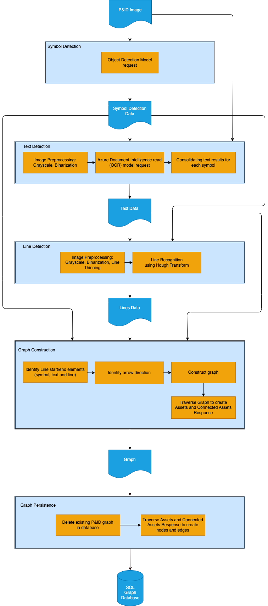
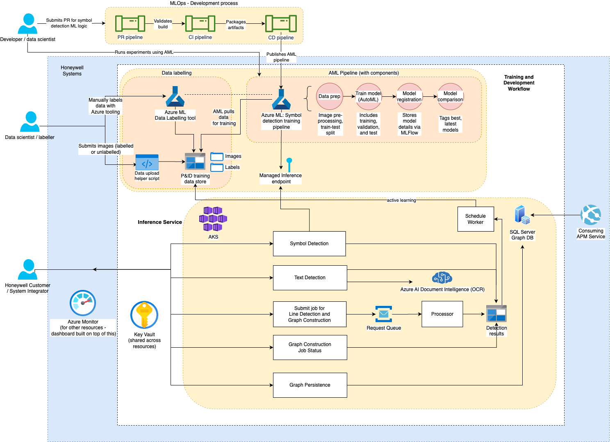
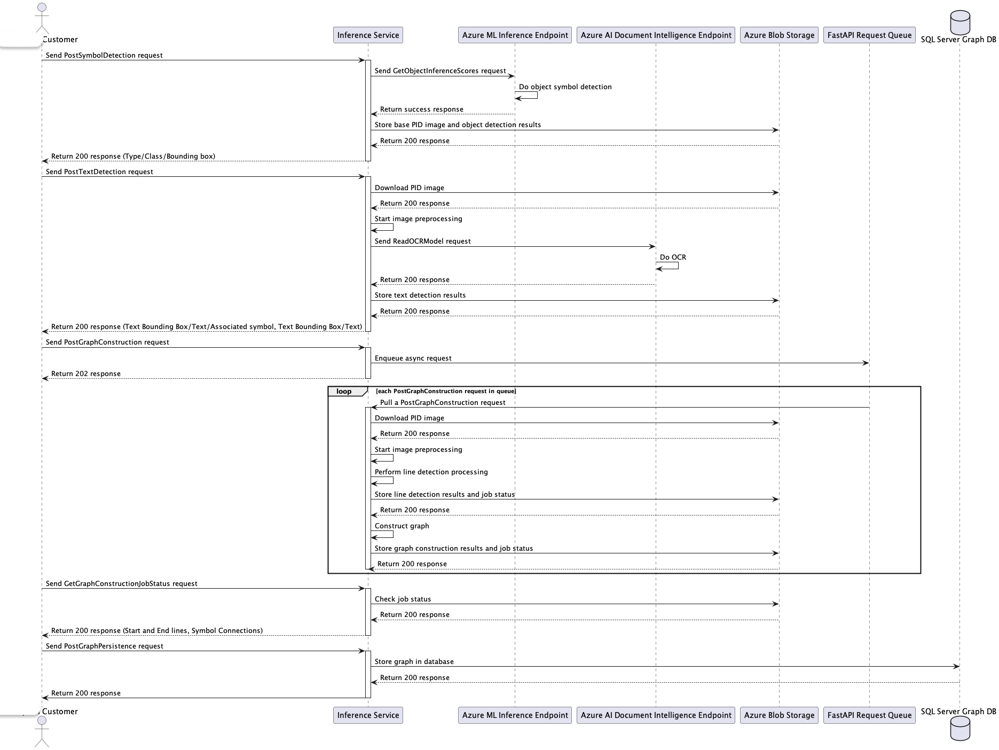
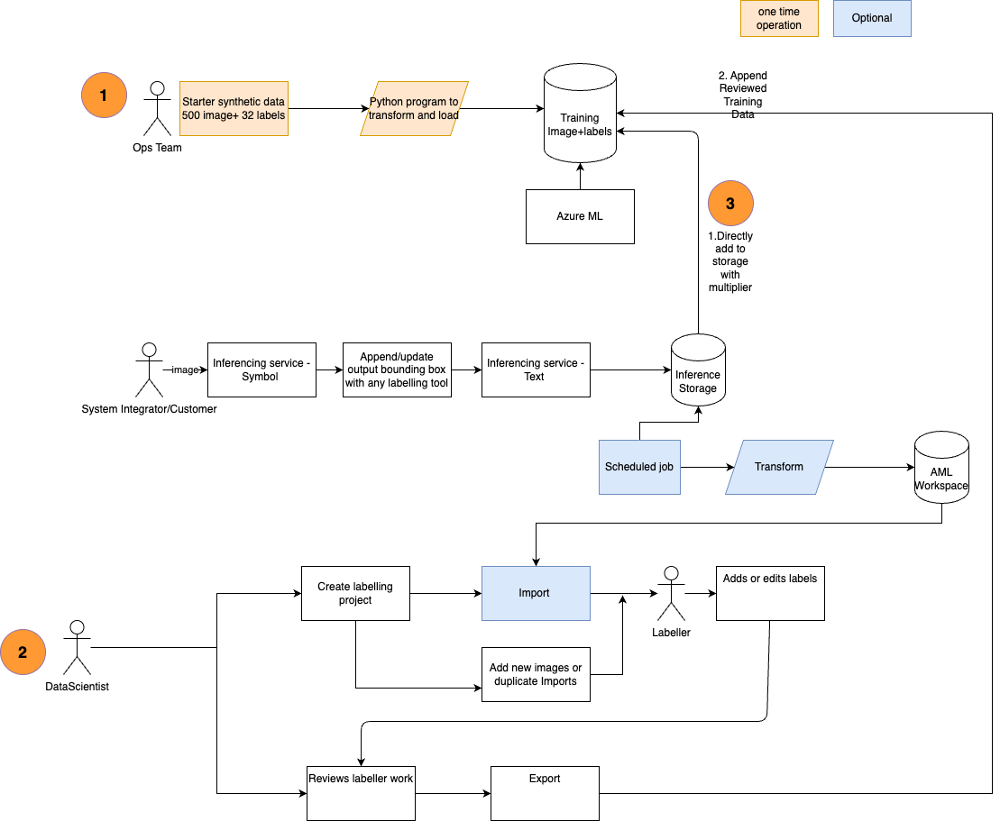
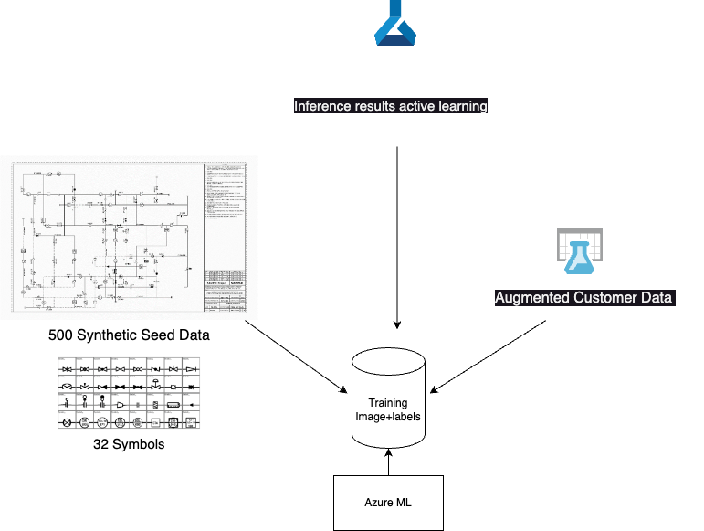

# Design for Digitization of P&ID

The goal of this document is to describe the design for digitization of P&ID.

- [The Model & Graph components](#the-model--graph-components)
- [MLOps](#mlops)
- [High Level architecture](#high-level-architecture)
- [API Contracts](#api-contracts)
- [Augmenting Training Data](#augmenting-training-data)

## The Model & Graph components

There are 5 main components described below. Our approach is like the one
described in [this paper](https://doi.org/10.1093/jcde/qwac056) published in
*Journal of Computational Design and Engineering*, Volume 9, Issue 4, August
2022 on digitizing P&ID but with the training data set described above. The
approach described in the paper was tested on 5 different P&IDs, and they were
able to achieve a precision/recall performance of over 90/90 with a large
training dataset comprising 75K symbol, 10K text, and 90K line data.

### Symbol Detection

The P&ID diagram are pre-processed by filtering techniques and then we
use the object detection model trained using AutoML in Azure ML to detect the trained symbols and
provide bounding boxes for the detected symbols. The model groups the
symbols into 3 categories: equipment (E), piping (P) and instrumentation (I) which
are the key components of the graph.

We use an annotated synthetic dataset of 500 P&IDs that was generated
by incorporating different types of noise and symbols (32 symbols) made
available for public use from [this paper](https://arxiv.org/pdf/2109.03794.pdf). The annotation includes labels for symbols, lines, text as .npy
files. We utilize Azure Machine Learning service to train a YOLOv2 model to detect the symbols. The model can be deployed as an endpoint in Azure ML. The source code also for the model training can be found [here](https://github.com/Azure-Samples/MLOpsManufacturing/tree/main/samples/amlv2_pid_symbol_detection_train).

The symbols have been classified into three main categories - instruments, piping, and equipment - and each symbol has been assigned a unique label within this hierarchy, following the format `<Instrument OR Piping OR Equipment>/<Subcategory>/<Display label>`.

More information on augmenting the training data can be found in [the section below](#augmenting-training-data).
Note that this process has already started during the course of this project: symbols 1-32 correspond to the symbol set from the original synthetic training dataset,
while symbols with ID 33 onwards can be added for new symbols that need to be detected in the P&ID images.

### Text Detection

The P&ID diagram undergoes some minor image pre-processing and we use the Azure AI Document Intelligence (formerly known as Azure Form Recognizer) high resolution OCR functionality to detect text in the image. This step extracts the text and
the bounding box co-ordinates where the text is present, and associate text with the symbols detected in the previous step.

### Line Detection

The P&ID diagram is pre-processed by applying thinning and filtering
techniques, as well as removing the bounding boxes of the symbols and text detected in the previous steps.
The Hough transform, a widely-used image processing technique for feature extraction, is used to detect line segments in the image. The detected lines are utilized to determine connected lines, type (solid/dotted) and direction.

The remaining two components are about
constructing and persisting the graph using symbol detection, text detection and line detection information.

### Graph Construction

The symbol detection, text detection and line detection information are
consolidated into a graph format to represent the symbols, text, and lines as nodes and establish
connections as edges by applying certain rules. We intend to use python
libraries such as NetworkX,
[Shapely](https://shapely.readthedocs.io/en/stable/manual.html) that are pretty
good at graph manipulation before we store the final connected graph.

### Graph Persistence

Finally, the graph needs to be persisted. We used SQL Graph DB mainly
for simplicity.

. The graph design is described in [this document](./design-db.md).

## High Level architecture

There are be three workflows:

1. **Inference Workflow:** Each component of the digitization process (Symbol
    detection, Text Detection, Line Detection, Graph Construction and
    Persistence) will be accessible to the client as endpoints but are all part
    of the same service. This opens up the possibility to develop a UI application 
    in future to enable user interaction during the process, running a step multiple 
    times if need be, allowing for approval or modifications to be made to the 
    output before it proceeds to the next step. The service can be deployed 
    in AKS (Azure Kubernetes Service).

1. **Training and Development Workflow:** Apart from the MLOps flow described
    earlier, a command line script can be created to batch upload training data
    to the required datastore. This would be useful to use alternate labelling 
    tools to Azure ML Studio Labelling.

1. **Active learning:** We assumed that all newly submitted P&IDs for inference 
    can be used for our training once approved. We want to capture the output 
    of the inference workflow and copy it over to a review datastore. This is 
    not something that customers may want to have always. 



## API Contracts



### PostSymbolDetection

Performs symbol object detection on the P&ID image. The API stores the P&ID image and symbol object detection output into the Blob Storage. Multiple calls replace the existing output in the Blob Storage (in symbol detection directory).

- Input: P&ID Image, Equipment Bounding Box and Unique Id
- Output: Symbol Detection Inference Results [Symbol Bounding Box/Type/Class]

### PostTextDetection

Performs text detection on a P&ID image related by the Unique Id. The API stores the **corrected** symbol object detection output and the text detection output into the Blob Storage (in text detection directory). Multiple calls replace the existing output in the Blob Storage.

- Input: Corrected Symbol Detection Results and Unique Id
- Output: Text Detection Inference Results [Text Bounding Box/Text/Associated symbol, Text Bounding Box/Text]
- Other error codes: 422 http code if P&ID image has never been provided

### PostGraphConstruction

Submits a job into a request queue to perform two processings - line detection and graph construction - on a P&ID image related by the Unique Id.
Returns 202 http code if the server accepted the request.

Before the job execution starts, it stores the **corrected** text detection output.

Once the job executions starts:

- For line detection step, the image is pre-processed by removing symbols and texts to facilitate the Hough Transform
logic and obtain the line coordinates.
- For graph construction step, it builds a graph using the symbol, text and line detection outputs to represent the
 terminals (representative symbols) with their connections, indicating the flow direction.

In each of these steps, the outputs are stored into the Blob Storage (in graph construction directory).
Multiple calls replace the existing output in the Blob Storage.

- Input: Corrected Line Detection Inference Results, Unique Id
- Output: Line Detection Results [Array of start & end lines], Symbol Terminals with their connections
- Other error codes: 422 http code if PID image has never been provided

### GetGraphConstructionJobStatus

Queries the state of the graph construction job related by Unique Id

- Input: Unique Id
- Output: Status, Error message
- Other error codes: 404 http code if the job does not exist

### PostGraphPersistence

Persists the graph into the database.

- Input: Unique Id, Symbol terminals with their connections
- Output: 201 Created

### GetInferenceResults

Gets the latest inference output related by the Unique Id and Inference Type. The API looks first for the corrected output, otherwise the original output.

- Input: Unique Id, InferenceType
- Output: One of the followings results:
  - Symbol Detection Inference Results [Symbol Bounding Box/Type/Class]
  - Text Detection Inference Results [Text Bounding Box/Text/Associated symbol, Text Bounding Box/Text]
  - Line Detection results [Array of start & end lines]
  - Symbol Terminals with their connections
- Other error codes: 404 http code if the symbol detected output does not exist yet.

### GetInferenceResultImages

Gets the inference debug images related by the Unique Id and Inference Type.

- Input: Unique Id, InferenceType
- Output: Debug image
- Other error codes: 404 http code if the symbol detected output does not exist yet.

### Blob Storage File Directory Structure

The file directory will be organized by the unique identifier for the P&ID to query the state of the detection phases.
Within each folder, there will be subdirectories classified by inference job step to store the outputs and debug content of each step.

A sample representation of this directory structure:

```text
inference-results/
├─ <pid_id>/
│  ├─ symbol-detection/
│  │  ├─ <pid_id>.png
│  │  ├─ response.json
│  │  ├─ output_<pid_id>_symbol_detection.png
│  ├─ text-detection/
│  │  ├─ request.json
│  │  ├─ response.json
│  │  ├─ output_<pid_id>_text_detection.png
│  │  ├─ debug_<pid_id>_text.png
│  ├─ graph-construction/
│  │  ├─ request.json
│  │  ├─ response_line-detection.json
│  │  ├─ response_graph-construction.json
│  │  ├─ response_arrows_line_source.json
│  │  ├─ job_status.json
│  │  ├─ output_<pid_id>_line-detection.png
│  │  ├─ output_<pid_id>_graph-construction.png
│  │  ├─ debug_<pid_id>_preprocessed_before_thinning.png
│  │  ├─ debug_<pid_id>_preprocessed.png
│  │  ├─ debug_<pid_id>_preprocessed_graph_with_lines_and_symbols.png
```

Note that:

- The input P&ID image is stored in the `symbol-detection/` folder.
- The top level of the directory structure above is the name of the container in the associated blob storage account.
  These are configured in the environment variables `BLOB_STORAGE_ACCOUNT_URL` and `BLOB_STORAGE_CONTAINER_NAME`.
- The request/response JSON and images prefixed with `output_` are always output to the configured storage.
  Debug output (images prefixed with `debug_`) are output based on the `DEBUG` environment variable.
- No versioning is supported in Blob Storage.
- No support APIs to access debug images.

## Augmenting Training Data



The training data can be augmented to recognize more symbols. The three funnels of data for training are:

- By default it is seeded with 32 std instrumentation and piping symbols
- Option 2. The data scientists can add their own training data which after labelling can be pushed to the training dataset.
- Option 3. Lastly the diagrams that are being sent to the inference API can also be used to augment the training data. The results from that could be fed directly into the training set if they have been manually reviewed during the inferencing or they can be sent to option 2 - Data scientists could move them whenever they have been reviewed and approved.

