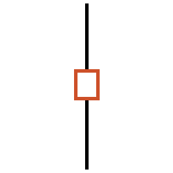
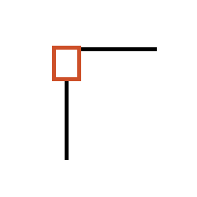
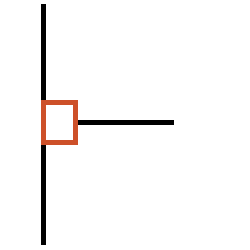
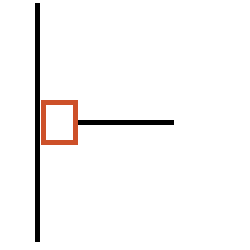
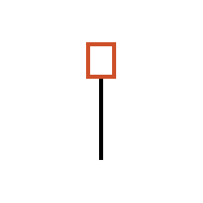
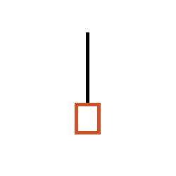
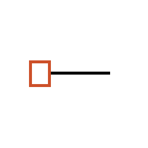
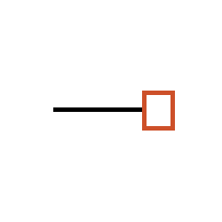
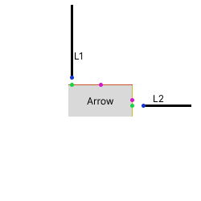

# Arrow Direction Detection Design <!-- omit in toc -->

This document covers the design for arrow direction detection.

## Table of Contents <!-- omit in toc -->

- [Goal](#goal)
- [Solution](#solution)
  - [Arrow Node Cases](#arrow-node-cases)
    - [Case 1](#case-1)
    - [Case 2](#case-2)
    - [Case 3](#case-3)
    - [Case 4](#case-4)
  - [Arrow Orientation Assignment](#arrow-orientation-assignment)
    - [Vertical Line with Arrow at Line Start](#vertical-line-with-arrow-at-line-start)
    - [Vertical Line with Arrow at Line End](#vertical-line-with-arrow-at-line-end)
    - [Horizontal Line with Arrow at Line Start](#horizontal-line-with-arrow-at-line-start)
    - [Horizontal Line with Arrow at Line End](#horizontal-line-with-arrow-at-line-end)
- [Experiment Results](#experiment-results)
- [Appendix](#appendix)

## Goal

Symbol detection detects the position of the arrow symbols, and with the end-user's help, the API should have knowledge of the location of all arrows by during text detection.
While the positions of all arrows are known, the orientation of arrows remains unknown.
Using heuristics of the lines and the intersection points of lines and the arrow symbol bounding box, the position of the arrow can be predicted with high confidence.
There are a few difference cases that will be addressed in this doucment to better understand the flow direction in the PID by the arrow orientation.

## Solution

### Arrow Node Cases

There are 4 cases that should appear with an arrow node.
The cases and the way of handling the cases are outlined below.

#### Case 1



In case 1, there are two lines that are associated with a arrow bounding box, and the lines have the same slope.
In this case, it is very difficult to understand the arrow orientation, so no orientation is assigned to this arrow symbol.

#### Case 2



In case 2, there are two lines that are associated with a arrow bounding box, and the lines have different slopes.
In this case, the line that is closer to the intersecting side's centroid is used to assign the arrow direction.

#### Case 3



In case 3, there are three lines that are associated with a arrow bounding box, and one of the lines has a different slope.
In this case, the line that is closer to the intersecting side's centroid is used to assign the arrow direction.

#### Case 4



In case 4, there is one line that intersects and another line that is associated but does not intersect the arrow bounding box
In this case, the line that intersects is used to assign the arrow direction.

### Arrow Orientation Assignment

Depending on the line orientation that is used to assign the arrow direction, the arrow can take different values.
The samples below is an exhaustive set of all the difference combinations and the resulting arrow direction that is assigned.

#### Vertical Line with Arrow at Line Start



**Arrow Orientation:** up

#### Vertical Line with Arrow at Line End



**Arrow Orientation:** down

#### Horizontal Line with Arrow at Line Start



**Arrow Orientation:** left

#### Horizontal Line with Arrow at Line End



**Arrow Orientation:** right

## Experiment Results

Spike results are documented [here](../spikes/arrow-detection/README.md).

## Appendix

### Centroid from the sides of the arrow bounding box



#### Legend

- **blue dot:** The line point that is closest to the arrow polygon
- **green dot:** The theoretical point of intersection if the line is extended to the bounds of the arrow
- **magenta dot:** The centroid of the polygon side

The goal of the centroid-based matching is to compare the distance between the green dots and the corresponding magenta dot.
The line with the green dot that is closest to the corresponding polygon side's centroid is deemed to be the line that associates direction to the arrow.
The distance should be normalized to account for the sides being different lengths.
The normalized distance calculation is as follows:

```python
theoretical_point_of_intersection = Point(...)
centroid = Point(...)

side_length = side.length
normalized_distance = theoretical_point_of_intersection.distance(centroid) / (side_length / 2)
```
