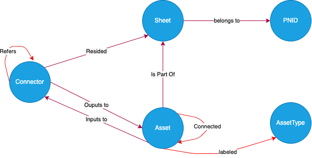

# Graph DB for Persisting Graph

This document covers the design for graph database for persisting graph.

This [directory](../spikes/graph-db/) contains code samples and documents pertaining the graph database design.

## Table of Contents <!-- omit in toc -->

- [Goal](#goal)
- [Requirements](#requirements)
- [Proposed Graph Database Schema](#proposed-graph-database-schema)
- [Node Design](#node-design)
  - [PnID Node](#pnid-node)
  - [Sheet Node](#sheet-node)
  - [Asset Node](#asset-node)
  - [AssetType Node](#asset-type-node)
  - [Connector Node](#connector-node)
- [Edge Design](#edge-design)
  - [Sheets Belongs To PnID Edge](#sheets-belongs-to-pnid-edge)
  - [Asset Is Part Of Sheet Edge](#asset-is-part-of-sheet-edge)
  - [Asset Connected To Asset Edge](#asset-connected-to-asset-edge)
  - [Asset labeled with Asset Type Edge](#asset-labeled-with-asset-type-edge)
  - [Connector Resides In Sheet Edge](#connector-resides-in-sheet-edge)
  - [Connector Outputs to Asset Edge](#connector-outputs-to-asset-edge)
  - [Asset Inputs to Connector Edge](#asset-inputs-to-connector-edge)
- [Queries](#queries)
- [Service Design](#service-design)

## Goal

In order to store a graph in a graph database, we need to design a schema for the database. The schema should be able to store the graph in a way that is easy to query and update. The schema should also be able to store the graph in a way that is easy to understand and maintain.

A SQL Graph DB is a database that stores data in the form of a graph. A graph is a collection of nodes and edges. Nodes are the entities in the graph, and edges are the relationships between the entities. Edges are always directed and connect two nodes. A graph database stores data in the form of a relational database, so the nodes and edges are stored as tables.

As per our requirements, a PNID diagram will be a collections of sheets and each sheet will have a collection of assets that are connected to each other. Each sheet can have multiple connectors and assets. Another main components in a diagram are the connectors that usually linkes to an asset located in the same or refers to an asset in different sheet or diagram.

## Requirements

Functional Requirements:

- Query all connected assets to a given asset.
- Enquire all the assets that are parts of a PnID diagram.
- Enquire all downstream and upstream assets for a given asset.
- Query all lines that connecting two assets.
- Enquire the meta data of an asset including its bounding box information and label for an asset.
- Enquire all assets from a specific instrument category part of in a PNID diagram.

Technical Requirements:

- Enable [Azure Active Directory authentication](https://learn.microsoft.com/en-us/azure/azure-sql/database/azure-sql-passwordless-migration-python?view=azuresql&tabs=sign-in-visual-studio-code%2Cazure-portal-create%2Cazure-portal-assign%2Capp-service-identity) to login into the database using Azure AD credentials and roles
- Use [PyODBC](https://learn.microsoft.com/en-us/sql/connect/python/pyodbc/python-sql-driver-pyodbc?view=sql-server-ver16) over [PyMSSQL](https://learn.microsoft.com/en-us/sql/connect/python/pymssql/python-sql-driver-pymssql?view=sql-server-ver16)

## Proposed Graph Database Schema



## Node Design

### PnID Node

This node will store the PnID diagram information including any metadata associated with the diagram as a json string into attributes.

```sql
CREATE TABLE [pnide].[PNID]
(
    [Id] NVARCHAR(255) NOT NULL PRIMARY KEY,
    [name] NVARCHAR(255) NOT NULL,
    [attributes] NVARCHAR(MAX) NULL,
) as NODE;
```

where `Id` is the unique identifier for the PnID diagram, `name` is the name of the PnID, and `attributes` is the attributes of the PnID in json format.

#### Example

| Id | Name | Attributes |
|---|---|---|
| 123 | Pipping and Instrumentation - Central Training | `{ "issue_date": "August 2019", "issue_for": "Central Training", ... }` |

### Sheet Node

The sheet node will be used to store the diagram information located in a sheet of an PnID diagram. The sheet node will also store any metadata associated with the sheet as a json string into attributes including the size of image and the inclusive box specifying the area of the main diagram.

```sql
CREATE TABLE [pnide].[Sheet]
(
    [Id] NVARCHAR(255) NOT NULL PRIMARY KEY,
    [name] NVARCHAR(255) NOT NULL,
    [attributes] NVARCHAR(MAX) NULL,
) as NODE;
```

where `Id` is the unique identifier for the sheet, `name` is the name of the sheet, and `attributes` is the attributes of the sheet in json format
including the size of image and the inclusive box specifying the area of the main diagram. `Id` will be a combination of the PNID Id and sheet number.

#### Example

| Id | Name | Attributes |
|---|---|---|
| 123-D001 | Sheet 1: Truck Unloading and Transfer Pack | `{ "image_details": { "width": 1024, "height": 768 }, ... }` |
| 123-D100 | Sheet 2: Air Stripper and Deformer  | `{ "image_details": { "width": 1024, "height": 768 }, ... }` |

### Asset Node

```sql
CREATE TABLE [pnide].[Asset]
(
  [Id] NVARCHAR(255) NOT NULL PRIMARY KEY,
  [text_associated] NVARCHAR(255) NULL,
  [attributes] NVARCHAR(MAX) NULL,
) as NODE;
```

where `Id` is the unique identifier for the asset, `text_associated` is the text associated with the asset, and `attributes` is the attributes of the asset in json format including its bounding box information.
We will add the sheet `id` as a prefix to the asset `id' to make it unique.

#### Example

| Id | Text_associated | Attributes |
|---|---|---|
| 123-D001-1 | 2" V1411 | `{ "bounding_box": { "topX": 0.0, "topY": 0.0,  "bottomX": 0.2, "bottomY": 0.2 }, ... }` |

### Asset Type Node

```sql
CREATE TABLE [pnide].[AssetType]
(
    [Id] int NOT NULL PRIMARY KEY,
    [category] NVARCHAR(255) NOT NULL,
    [subcategory] NVARCHAR(255) NOT NULL,
    [displayname] NVARCHAR(255) NOT NULL,
    [uniquestring] AS ([category] + '/' + [subcategory] + '/' + [displayname]) PERSISTED UNIQUE
) as NODE;
```

where `Id` is the unique identifier for the asset type, `category` is the category of the asset, `subcategory` is the subcategory of the asset, `displayname` is the display name of the asset, and `uniquestring` is the unique string of the asset type. `uniquestring` will be a combination of the type, the category and subcategory of the asset type.

#### Example

| Id  | category | subcategory | displayname | uniquestring |
|----|----------|-------------|-------------|--------------|
| 1	| Instrument | Valve | Welded gate valve | Instrument/Valve/Welded gate valve |

### Connector Node

```sql
CREATE TABLE [pnide].[Connector]
(
    [Id] NVARCHAR(255) NOT NULL PRIMARY KEY,
    [text_associated] NVARCHAR(255) NOT NULL,
    [attributes] NVARCHAR(MAX) NULL,
) as NODE;
```

where `Id` is the unique identifier for the connector, `text_associated` is the text associated with the connector, and `attributes` is the attributes of the connector in json format. `id` will be the unique identifier of the connector extracted from the diagram located in the top left corner of the connector. It usually a four character id which is unique across all diagrams.

#### Example

| Id | text_associated | Attributes |
|---|---|---|
| 123-D001-2 | RAW FEED TO 1703 | `{ "bounding_box": { "topX": 0.0, "topY": 0.0,  "bottomX": 0.2, "bottomY": 0.2 }, ... }` |

## Edge Design

The edges will represent all the relationships between the nodes. The edges will be used to connect the nodes and may contain any information about the relationship between the nodes.

### Sheets Belongs To PnID Edge

This edge will be used to connect the sheets to the PnID diagram. This will show that the sheet belongs to which PnID diagram.

```sql
CREATE TABLE [pnide].[Belongs] (
    CONSTRAINT EC_CONNECTION_BELONGS CONNECTION ([pnide].[Sheet] TO [pnide].[PnID]) ON DELETE CASCADE
) as EDGE;
```

### Asset Is Part Of Sheet Edge

This edge will be used to connect the assets to the sheet. This will show that the asset is a part of which sheet.

```sql
CREATE TABLE [pnide].[IsPartOf] (
    CONSTRAINT EC_CONNECTION_IS_PART_OF CONNECTION ([pnide].[Asset] TO [pnide].[Sheet]) ON DELETE CASCADE
) as EDGE;
```

### Asset Connected To Asset Edge

This edge will be used to connect the assets to each other on a downstream path. This will show that the asset is connected to which assets.

```sql
CREATE TABLE [pnide].[Connected] (
    [segments] NVARCHAR(MAX) NULL,
    CONSTRAINT EC_CONNECTION_CONNECTED CONNECTION ([pnide].[Asset] TO [pnide].[Asset]) ON DELETE CASCADE
) as EDGE;
```

where `segments` is the list of lines connecting the assets in a json format.

Let's visualize `Asset A` is connected to `Asset B` as an edge, it means `Asset B` is a downstream of `Asset A`, or in reverse direction,
`Asset A` is an upstream of `Asset B`.

### Asset Labeled With Asset Type Edge

This edge will be used to label the asset to an asset type. This will show that the asset is labeled to which asset type.

```sql
CREATE TABLE [pnide].[Labeled] (
    CONSTRAINT EC_CONNECTION_LABELED CONNECTION ([pnide].[Asset] TO [pnide].[AssetType]) ON DELETE CASCADE
) as EDGE;
```

### Connector Resides In Sheet Edge

This edge will be used to show which sheet the connectors reside on.

```sql
CREATE TABLE [pnide].[Resides] (
    CONSTRAINT EC_CONNECTION_RESIDES CONNECTION ([pnide].[Connector] TO [pnide].[Sheet]) ON DELETE CASCADE
) as EDGE;
```

### Connector Outputs to Asset Edge

This edge will show the output from a connector to an asset in the same/different sheet.

```sql
CREATE TABLE [pnide].[Outputs] (
    CONSTRAINT EC_CONNECTION_OUTPUTS CONNECTION ([pnide].[Connector] TO [pnide].[Asset]) ON DELETE CASCADE
) as EDGE;
```

### Asset Inputs to Connector Edge

This edge will will show the input from an asset to a connector in the sheet.

```sql
CREATE TABLE [pnide].[Inputs] (
    CONSTRAINT EC_CONNECTION_INPUTS CONNECTION ([pnide].[Asset] TO [pnide].[Connector]) ON DELETE CASCADE
) as EDGE;
```

### Connector Refers to Connector Edge

This edge will show the input from a connector to a connector in the same sheet.

```sql
CREATE TABLE [pnide].[Refers] (
    CONSTRAINT EC_CONNECTION_REFERS CONNECTION ([pnide].[Connector] TO [pnide].[Connector]) ON DELETE CASCADE
) as EDGE;
```

## Queries

### Query all connected assets to a given asset

- Query all the assets that are used in a PNID diagram.:

```sql
SELECT asset.Id, asset.text_associated
FROM [pnide].[Asset] as asset, pnide.ispartof as ispartof, [pnide].[sheet] as sheet, [pnide].[belongs] as belongs, [pnide].[pnid] as pnid
WHERE MATCH (asset-(ispartof)->sheet-(belongs)->pnid)
AND pnid.Id = '{pnid}';
```

- Query for all connected assets to a given asset:

```sql
SELECT connected_asset.Id, connected_asset.text_associated
FROM [pnide].[Asset] as asset, pnide.connected as connected, [pnide].[Asset] as connected_asset
WHERE MATCH (asset-(connected)->connected_asset)
AND asset.Id = '{given asset id}';
```

- Enquire all downstream assets for a given asset.

```sql
SELECT connected_asset.Id, connected_asset.text_associated
FROM [pnide].[Asset] as asset, pnide.connected as connected, [pnide].[Asset] as connected_asset
WHERE MATCH (asset-(connected)->connected_asset)
AND asset.Id = '{given asset id}';
```

- Query all lines that connecting two assets.

```sql
SELECT connected.segments
FROM [pnide].[Asset] as asset, pnide.connected as connected, [pnide].[Asset] as connected_asset
WHERE MATCH (asset-(connected)->connected_asset)
AND (asset.Id = '{given asset id 1}' and connected_asset.id = '{given asset id 2}')
```

OR

```sql
SELECT connected.segments
FROM pnide.connected as connected
WHERE $from_id = (SELECT $NODE_ID FROM [pnide].[Asset] WHERE id = '{given asset id 1}') and $to_id = (SELECT $NODE_ID FROM [pnide].[Asset] WHERE id = '{given asset id 2}');
```

- Enquire the meta data of an asset including its bounding box information and label for an asset.

```sql
SELECT asset.Id, asset.label, asset.attributes
FROM [pnide].[Asset] as asset
WHERE asset.Id = '{given asset id}';
```

- Enquire all assets from a specific instrument category used in a PNID diagram.

```sql
SELECT asset.Id, asset.label, asset.attributes
FROM [pnide].[Asset] as asset, pnide.ispartof as ispartof, [pnide].[sheet] as sheet, [pnide].[belongs] as belongs, [pnide].[pnid] as pnid
WHERE MATCH (asset-(ispartof)->sheet-(belongs)->pnid)
AND pnid.Id = '{pnid}' AND asset.label = '{given label}';
```

## Service Design

This service will read the output of the graph construction and then will convert it to the graph database entities. The service will be responsible for creating the nodes and edges in the graph database. This service will process one single sheet at a time.

Currently, all APIs are getting only `pnid` as an input but all services needs to handle `sheet id` as well. In order to do that, we need to change the APIs to get `sheet id` as well and and then we need to change the folder structure to have a folder for each sheet.

Additionally, the asset type nodes will be inserted on demand during the asset insertion, only if, the asset type does not exist in the database.

Note: since we do not extract `sheet id` as a part of the graph construction, we will use a dummy `sheet id` in our implementation in the first iteration. So in the first iteration, we will not do any changes in the folder structure to have a seprate folder for each sheet.

```python
    pnid_node = Pnid(id=pnid, name=pnid, attributes={})
    sheet = Sheet(id=sheet_id, name=sheet_id, attributes={})

    cursor = db_connection.cursor()

    try:
        cursor.execute("BEGIN TRANSACTION")

        create_pnid_node(cursor, pnid)
        create_sheet_node(cursor, sheet, pnid)
        create_sheet_belogons_pnid_edge(cursor, sheet, pnid)

        created_asset_type_nodes = set()

        # If needed, create new asset types
        for asset in graph_construction_results.connected_symbols:

            if asset.label not in created_asset_type_nodes
               not is_connector(asset.label) and \
               not asset_type_exists(asset.label):
                create_asset_type_node(asset.label)
                created_asset_type_nodes.add(asset.label)

            for connection in asset.connections:
                if connection.label not in created_asset_type_nodes
                   not is_connector(connection.label) and \
                   not asset_type_exists(connection.label):
                    create_asset_type_node(asset.label)
                    created_asset_type_nodes.add(asset.label)

        created_nodes = set()  # assets and connector ids

        # Create all the assets and connectors
        for asset in graph_construction_results.connected_symbols:

            if is_connector(asset.label):
                connector_node_id = get_connector_node_id(cursor, asset, sheet, pnid)
                if connector_node_id not in created_nodes:
                    create_connector_node(cursor, asset, sheet, pnid)
                    create_connector_resides_sheet_edge(cursor, asset, sheet, pnid)
                    created_nodes.add(connector_node_id)
            else:
                asset_node_id = get_asset_node_id(cursor, asset, sheet, pnid)
                if asset_node_id not in created_nodes:
                    create_asset_node(cursor, asset, sheet, pnid)
                    create_asset_ispartof_sheet_edge(cursor, asset, sheet, pnid)
                    create_asset_labeled_asset_type(cursor, asset, asset.label)
                    created_nodes.add(asset_node_id)

            for connection in asset.connections:
                if is_connector(connection.label):
                    connection_connector_node_id = get_connector_node_id(cursor, connection, sheet, pnid)
                    if connection_connector_node_id not in created_nodes:
                        create_connector_node(cursor, connection, sheet, pnid)
                        create_connector_resides_sheet_edge(cursor, connection, sheet, pnid)
                        created_nodes.add(connector_node_id)
                else:
                    connection_asset_node_id = get_asset_node_id(cursor, connection, sheet, pnid)
                    if connection_asset_node_id not in created_nodes:
                        create_asset_node(cursor, connection, sheet, pnid)
                        create_asset_ispartof_sheet_edge(cursor, connection, sheet, pnid)
                        create_asset_labeled_asset_type(cursor, asset, asset.label)
                        created_nodes.add(connection_node_id)


        # Create all edges
        for asset in graph_construction_results.connected_symbols:

            if is_connector(asset.label):
                # Connector is source. Hence, connector -> asset
                for connection in asset.connections:                        
                    if connection.flow_direction is FlowDirection.downstream or \
                       connection.flow_direction is FlowDirection.unknown:
                        if is_connector(connection.label):
                            create_connector_refers_connector_edge(cursor, asset, connection, sheet, pnid)
                        else:
                            create_connector_outputs_asset_edge(cursor, connection, asset, sheet, pnid)
            else:
                # Asset is source. Hence, asset -> asset or asset -> connector
                for connection in asset.connections:
                    if is_connector(connection.label):
                        if connection.flow_direction is FlowDirection.downstream or \
                           connection.flow_direction is FlowDirection.unknown:
                            create_asset_inputs_connector_edge(cursor, connection, asset, sheet, pnid)
                    else:
                        if connection.flow_direction is FlowDirection.downstream or \
                           connection.flow_direction is FlowDirection.unknown:
                            create_asset_connected_asset_edge(cursor, asset, connection, sheet, pnid)

        cursor.execute("COMMIT")
    except:
        cursor.execute("ROLLBACK")
    finally:
        cursor.close()
```