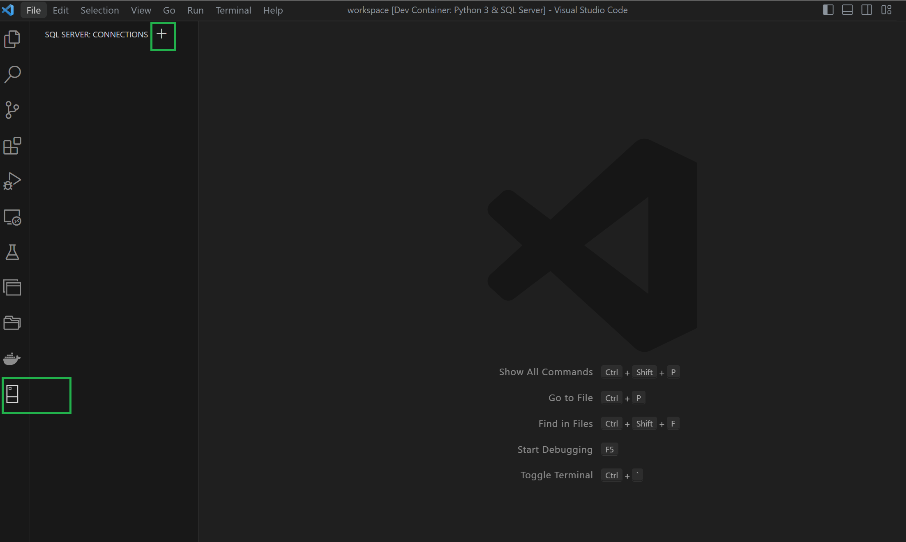

# SQL Graph DB Setup for local development

- [SQL Graph DB Setup for local development](#sql-graph-db-setup-for-local-development)
  - [Introduction](#introduction)
  - [How to add SQL connection profiles in VS Code using connection string format?](#how-to-add-sql-connection-profiles-in-vs-code-using-connection-string-format)
    - [Step 1: To add a SQL connection, from SQL Server click on `Add Connection` as shown](#step-1-to-add-a-sql-connection-from-sql-server-click-on-add-connection-as-shown)
    - [Step 2: Provide `Server name`](#step-2-provide-server-name)
    - [Step 3: Provide `Database name`](#step-3-provide-database-name)
    - [Step 4: Select `Authentication type`](#step-4-select-authentication-type)
    - [Step 5: Provide `User name`](#step-5-provide-user-name)
    - [Step 6: Provide `Password`](#step-6-provide-password)
    - [Step 7: Select `Yes` for `Save Password`](#step-7-select-yes-for-save-password)
    - [Step 8: Provide name for `Profile Name`](#step-8-provide-name-for-profile-name)
  - [Server details](#server-details)
    - [Connection details for DEV SQL Graph DB](#connection-details-for-dev-sql-graph-db)
      - [Connection details for local SQL Graph DB](#connection-details-for-local-sql-graph-db)
      - [Creating the database, schema, and tables](#creating-the-database-schema-and-tables)
  - [How to run SQL queries in VSCode?](#how-to-run-sql-queries-in-vscode)
  - [Graph SQL querying](#graph-sql-querying)
  - [Azure AD authentication setup](#azure-ad-authentication-setup)

## Introduction

This section aims to provide information for developers to establish connections with either the local SQL Graph DB or the Dev SQL Graph DB for their development tasks. To ensure a successful connection and facilitate your development tasks, it is essential to provide the specific server details. By following below instructions, you'll be able to seamlessly add the required connection and proceed with your development work.

In this context, we make the following assumptions:

- Visual Studio Code will serve as the preferred Integrated Development Environment (IDE) and the code is running in a Dev Container.
- SQL extensions, namely `ms-mssql.mssql` and `ms-mssql.sql-database-projects-vscode` are already installed in the development container.

SQL Graph design documentation can be found [here](design-db.md).

## How to add SQL connection profiles in VS Code using connection string format?

Specific [server details](#server-details) are provided in the later sections for reference.

### Step 1: To add a SQL connection, from SQL Server click on `Add Connection` as shown



### Step 2: Provide `Server name`


### Step 3: Provide `Database name`


### Step 4: Select `Authentication type`


### Step 5: Provide `User name`


### Step 6: Provide `Password`


### Step 7: Select `Yes` for `Save Password`


### Step 8: Provide name for `Profile Name`


- More guidance can be found [here](https://github.com/Microsoft/vscode-mssql/wiki/manage-connection-profiles) on connection profiles.

- If there is a connection issue, then look for [this](https://github.com/Microsoft/vscode-mssql/wiki/manage-connection-profiles) common issue.

## Server details

### Connection details for local SQL Graph DB

- `Server name` - db,1433
- [Optional] `Database name` - graph-data-model
- `User name` - sa
- `Password (SQL Login)` - Password from devcontainer.json file
- `Save Password?` - Yes
- [Optional] `Enter a name for this profile` - graph-data-model

You can use a similar approach to connect to Azure SQL Graph DB.

#### Creating the database, schema, and tables

If the local SQL Graph `graph-data-model` DB and schema is not yet created then below steps need to be executed after connection is established using VS Code SQL DB project publish feature:

1. Firstly, go to [this](/src/graph-db-model/) and open the SQL DB project using VS Code or Visual Studio.

2. Right click on DB project and first `Build` to make sure there are no errors. Then Click on `Publish`


3. Click on `Publish to an existing Azure SQL logical server`.


4. Click on `Don't use profile`.


5. Select the `localhost` connection profile that was created.


6. Select the database to where the publish needs to happen


7. Click `Publish`


Make sure it runs fine and the necessary tables are installed. Make sure the Database exists, if not create it beforehand.

## How to run SQL queries in VSCode?

Here is the necessary [tutorial](https://code.visualstudio.com/docs/languages/tsql) to get started on how to run queries via VSCode.

## Graph SQL querying

Sample queries to find data -

```SQL
SELECT * FROM
[pnide].[sheet] as sheet,
[pnide].[belongs] as belongs,
[pnide].[pnid] as pnid
WHERE MATCH (sheet-(belongs)->pnid)
AND pnid.Id = 'PNID1'

SELECT * FROM
[pnide].[Asset] as asset1,
[pnide].[Asset] as asset2,
[pnide].[Connected] as connected
WHERE MATCH (asset1-(connected)->asset2)
AND asset1.Id = 'Asset1'
```

Tutorial to figure on how to write [queries](https://learn.microsoft.com/en-us/sql/relational-databases/graphs/sql-graph-sample?view=sql-server-ver16).

## Azure AD authentication setup

The code has been configured to work with either the provided connecting string or through Azure AD authentication.

If you choose to use Azure AD authentication, it is essential to set up the required roles and permissions on the SQL Graph DB resource, as outlined in the following resource: [Azure SQL AD Authentication](https://learn.microsoft.com/en-us/sql/relational-databases/security/authentication-access/azure-ad-authentication-sql-server-setup-tutorial?view=sql-server-ver16)
