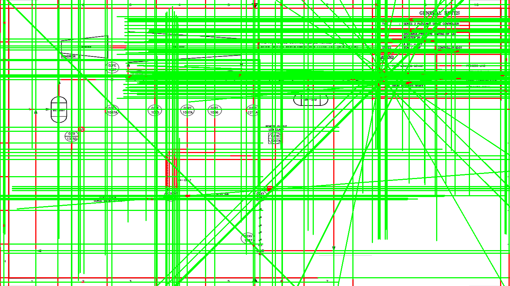
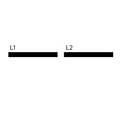
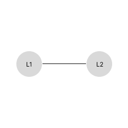
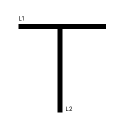
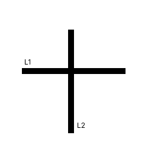
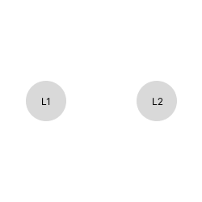
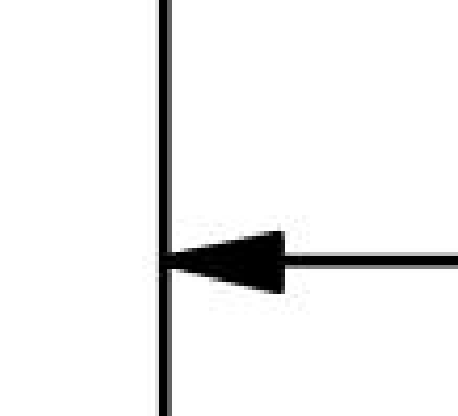
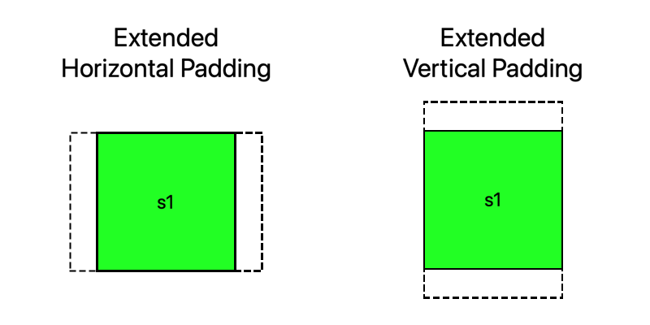
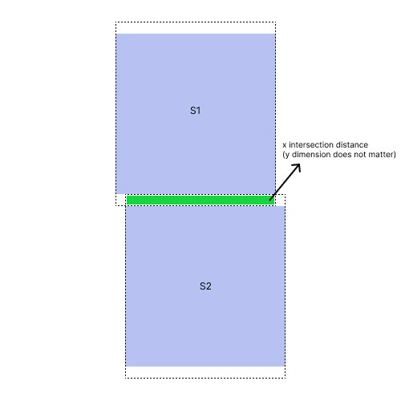
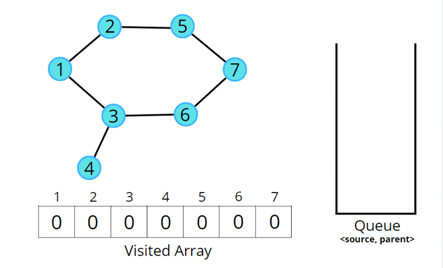

# Graph Construction Design <!--omit in toc-->

## Table of Contents

- [Graph Construction Design ](#graph-construction-design-)
  - [Table of Contents](#table-of-contents)
  - [Goal](#goal)
  - [High-Level Overview](#high-level-overview)
  - [Key Packages](#key-packages)
  - [Input](#input)
    - [Symbol and Text Data Sample](#symbol-and-text-data-sample)
    - [Line Data Sample](#line-data-sample)
    - [PID Content Region Bounding Box](#pid-content-region-bounding-box)
  - [Output](#output)
  - [Steps](#steps)
    - [Line Segment Preprocessing](#line-segment-preprocessing)
    - [Text Preprocessing](#text-preprocessing)
    - [Line start/end proximity-based candidate matching](#line-startend-proximity-based-candidate-matching)
      - [Line Proximity to Symbols](#line-proximity-to-symbols)
      - [Line Proximity to Text](#line-proximity-to-text)
      - [Line Proximity to Line](#line-proximity-to-line)
        - [Line Types](#line-types)
        - [Pseudocode](#pseudocode)
    - [Connecting Lines with the closest elements](#connecting-lines-with-the-closest-elements)
    - [Arrow-to-line proximity matching](#arrow-to-line-proximity-matching)
      - [Arrow Direction Detection](#arrow-direction-detection)
    - [Symbol-to-symbol proximity matching](#symbol-to-symbol-proximity-matching)
    - [Graph Traversal](#graph-traversal)
      - [Pseudocode](#pseudocode-1)
      - [Pseudocode Outline](#pseudocode-outline)
  - [API contracts](#api-contracts)
    - [POST Line Detection \[/api/pid-digitization/graph-construction/{pid\_id}\]](#post-line-detection-apipid-digitizationgraph-constructionpid_id)
      - [POST Graph Construction Input](#post-graph-construction-input)
      - [POST Graph Construction Output](#post-graph-construction-output)
    - [Get Graph Construction \[/api/pid-digitization/graph-construction/{pid\_id}\]](#get-graph-construction-apipid-digitizationgraph-constructionpid_id)
      - [Get Graph Construction Input](#get-graph-construction-input)
      - [GET Graph Construction Output](#get-graph-construction-output)

## Goal

The goal of graph construction is to take in all the information from symbol, text, and line detection and construct a representation of the connected symbols.
There are a few assumptions that are made when constructing this graph:

1. Parallel lines cannot be connected (and can thus be pruned out)

With these assumptions in mind, there are a few key steps that will make up the graph construction flow.
These steps are:

1. Line segment preprocessing
1. Text preprocessing
1. Line start/end proximity-based candidate matching
1. Connecting Lines with the closest elements
1. Arrow-to-line proximity matching
1. Symbol-to-symbol proximity matching
1. Graph Traversal

In the end, an object will be created that has the symbols connected.

**NOTE:** This design does not capture the flow direction.

## High-Level Overview

The design of graph construction takes heavy inspiration from [this paper](https://academic.oup.com/jcde/article/9/4/1298/6611631?login=false).
As mentioned in the [goal](#goal) section above, there are many steps needed to perform graph construction.
This section outlines a high-level overview of the steps to perform graph construction.

Before running through the steps, create nodes for all symbols and line segments.
These nodes are used later in the algorithm to connect the symbols and lines that fit specific criteria.
Each node must have a unique Id, so ensure that the Ids for the node and lines have a unique prefix.
The [spike code](../spikes/graph-construction/src/revision/main.py) uses `s-` for a symbol node prefix and `l-` for a line node prefix.
If the line node displaces a text element, use `lt-` as the node Id prefix.
After the nodes are created for symbols and lines, we can proceed with the preprocessing step.

Line segment preprocessing is needed to extend lines such that the line extensions can be used to prune out objects that cannot be connected to a specific line.
The logic of how the pruning occurs will be discussed later.
All lines have a `slope` and a `bias`.
If we pad the start and end `x` position of the line, we can extend the line using the linear equation `y = mx + b`.
A very small (configurable) buffer is applied to the extended lines.

The next phase is line-to-symbol, line-to-text, and line-to-line proximity-based candidate matching.
Here, for each line start and end position of the line segments, the points are compared with all other lines, all detected text, and all symbols to gather the candidates that are close to the line start and end.
Once the candidate matching finishes for all the lines, edges are drawn for the line nodes and their closest elements.
If the closest node to the line start/end is a text element, a new line node is dynamically created (such that no text node is created), and an edge is added between the two line nodes.
Low-degree arrow nodes are then associated with line nodes to solve for the case of a `T` intersection where the arrow is not paired with the line start/end.
After the line node association finishes, the distance between symbols is measured, and symbols within a certain distance threshold from each other are connected.

At this point, there is a connected graph where nodes are the symbols, and lines and the edges between the nodes denote the nodes are connected.
A query to this graph can be performed to see what objects are connected.
Finally, a graph traversal algorithm runs on the constructed graph to produce results in the desired output.

## Key Packages

- [NetworkX](https://networkx.org/documentation/stable/index.html)
- [Shapely](https://shapely.readthedocs.io/en/stable/manual.html)

## Input

The expected input into the graph construction step includes a few different components:

1. The updated symbol and text-associated data. There are a few things that are needed from this object:
   1. The symbols (that have been corrected before line detection)
   1. The list of all the text that was detected from the text detection step
1. The line segments from the [line detection step](./line-detection-design.md)
1. The region where the main PID content exists in the PID image.

### Symbol and Text Data Sample

```json
{
    "image_url": "sample_pid_1.png",
    "image_details": {
        "format": "png",
        "width": 1388,
        "height": 781
    },
    "all_text_list": [
        {
            "topX": 0.15994236311239193,
            "topY": 0.010243277848911651,
            "bottomX": 0.16570605187319884,
            "bottomY": 0.020486555697823303,
            "text": "2"
        },
        ...
    ],
    "text_and_symbols_associated_list": [
        {
            "topX": 0.4072882652,
            "topY": 0.3634068807,
            "bottomX": 0.4353595734,
            "bottomY": 0.4066899618,
            "id": 0,
            "label": "26",
            "score": null,
            "text_associated": "OZTT 1006"
        },
        ...
    ]
}
```

### Line Data Sample

```json
{
    "line_list": [
        {
            "startX": 0.0,
            "startY": 0.028169014084507043,
            "endX": 0.9978386167146974,
            "endY": 0.028169014084507043
        },
        ...
    ]
}
```

### PID Content Region Bounding Box

```json
{
    "topX": 0.0,
    "topY": 0.0,
    "bottomX": 0.8,
    "bottomY": 0.8
}
```

## Output

The output returns the immediate assets connected to the source asset.
Examples of assets are tags, LMIs, equipment, or any other symbol with an alpha-numeric name.
The expected output is a take on an adjacency list (in object form).
The output includes all connected symbols from a specific symbol with segments of lines and symbols that connect the assets.

```json
{
    "assets": [
        {
            "id": "<symbol_id>",
            "label": "<symbol_label>",
            "text_associated": "<symbol_text>",
            "bounding_box": {
                "topX": 0.0,
                "topY": 0.0,
                "bottomX": 0.0,
                "bottomY": 0.0
            },
            "connections": [
                {
                    "id": "<connected_symbol_id>",
                    "label": "<connected_symbol_label>",
                    "text_associated": "<connected_symbol_text>",
                    "flow_direction": "<flow_direction>",
                    "segments": [
                        {
                            "id": "<line_segment_id>",
                            "topX": 0.0,
                            "topY": 0.0,
                            "bottomX": 0.0,
                            "bottomY": 0.0
                        },
                        ...
                    ]
                }
            ]
        },
        ...
    ]
}
```

- **connected_symbols[\*].id**: The id of the source symbol
- **connected_symbols[\*].label**: The label of the source symbol
- **connected_symbols[\*].text_associated**: The text associated with the source symbol
- **connected_symbols[\*].bounding_box**: The bounding box location of the asset
- **connected_symbols[\*].connections[\*].id**: The id of the target symbol
- **connected_symbols[\*].connections[\*].label**: The label of the target symbol
- **connected_symbols[\*].connections[\*].text_associated**: The text-associated with the target symbol
- **connected_symbols[\*].connections[\*].flow_direction**: The flow direction from the source node to the target node. Values can be (`unknown`, `downstream`, or `upstream`)
- **connected_symbols[\*].connections[\*].segments**: The id and coordinates of the line segments between the assets.

  **NOTE**: Flow direction should only be set for equipment-to-equipment connections.

## Steps

### Line Segment Preprocessing

Line detection produces a list of line segments.
These segments can span the entire length of the actual line, a subset of the actual line, or even more than the length of the line.
The third case is rare and difficult to solve, so this document will outline the solution to solving the first 2 cases.
In a future step, lines need to be connected based on the proximity of the line starting and end points to each other.
There are a few steps to line preprocessing:

1. Find the start and end positions of the line
   1. If the line is vertical, the top point is the start and the bottom point is the end. If the line is not vertical, the start point is the farthest left and the end is the farthest right point.
1. Find the slope `(m)` of the line
1. Find the bias `(b)` of the line
1. Create a copy of all the line segments and pad extend the length and width of the line by manipulating the formula of the line `y = mx + b` and adding a small about of buffer.

**NOTE:** all the lines should be within the bounding box region of the main PID content.

In a future step, the extended lines will be used, but this is all that is needed to preprocess the lines

An example of the padded lines is below:



Here the normal lines are displayed in red and the extended lines are the green lines.
The extremes of the padding are displayed in this example and do not have to be this extreme.

### Text Preprocessing

Text detection isn't constrained to the main content of the bounding box. To reduce the compute, text outside of the main content area of the PID will be removed.

### Line start/end proximity-based candidate matching

There are a few steps that occur in the line proximity matching.
Each of these steps can add a new candidate for the line start or end point (depending on the candidate's proximity to the start/end position).
The operations occur for each line in the list of lines:

1. Check the proximity of the current line with all symbols
1. Check the proximity of the current line with all the detected text
1. Check the proximity of the current line with all other lines

Let's dive into each of the operations.

**NOTE:** the pseudocode presented in the sections below is not an optimized approach to solving the problem. The pseudocode should just be used as a guideline to understand how what operations need to be performed.

#### Line Proximity to Symbols

For each line in the list of lines, the proximity of the line start and end needs to be checked with all the different symbols.
Breaking this down into something more granular, here's the pseudocode:

```python
# Lines are a list of line coordinates.
# They also contain the slope, bias, and angle from the preprocessing step
for line, extended_line in zip(lines, extended_lines):
    start_point = get_start_point(line)
    end_point = get_end_point(line)
    for symbol in symbols:
        symbol_polygon = convert_to_polygon(symbol)
        # if there is no intersection between the extended line and the polygon we can skip it as there is a high likelihood there is no connection
        if not extended_line_polygon.intersects(symbol_polygon):
            continue
        start_point_distance = symbol_polygon.distance(start_point)
        end_point_distance = symbol_polygon.distance(end_point)
        if start_point_distance < SYMBOL_DISTANCE_THRESHOLD:
            # add new sample for the start point
            add_new_coordinate_candidate(line.id, start=True, ...<data to add>)
        if end_point_distance < SYMBOL_DISTANCE_THRESHOLD:
            # follow the same logic as the start_point comparison block
```

From the pseudocode above, there are a few key points.

1. Both lines and extended lines are used to see if a line should be associated with a symbol.
   It is assumed that only lines (if extended) that intersect with a symbol are the only candidates for line and symbol connections
1. If the symbol is within a distance threshold, the contents (the most important part is the Id of the symbol and the distance) are added to the candidates to the start or end point.

#### Line Proximity to Text

For each line in the list of lines, the proximity of the line start and end needs to be checked with the different text elements.
Breaking this down into something more granular, here's the pseudocode:

```python
# Lines are a list of line coordinates.
# They also contain the slope, bias, and angle from the preprocessing step
for line, extended_line in zip(lines, extended_lines):
    start_point = get_start_point(line)
    end_point = get_end_point(line)
    for text in text_list:
        text_polygon = convert_to_polygon(text)
        # if there is no intersection between the extended line and the polygon we can skip it as there is a high likelihood there is no connection
        if not extended_line_polygon.intersects(text_polygon):
            continue
        start_point_distance = symbol_polygon.distance(start_point)
        end_point_distance = symbol_polygon.distance(end_point)
        if start_point_distance < TEXT_DISTANCE_THRESHOLD:
            # add new sample for the start point
            add_new_coordinate_candidate(line.id, start=True, ...<data to add>)
        if end_point_distance < TEXT_DISTANCE_THRESHOLD:
            # follow the same logic as the start_point comparison block
```

From the pseudocode above, there are a few key points.

1. Both lines and extended lines are used to see if a line should be associated with a text.
   It is assumed that only lines (if extended) that intersect with text are the only candidates for line and text connections
1. If the text is within a distance threshold, the contents (the most important part is the Id of the symbol and the distance) are added to the candidates to the start or end point.


#### Line Proximity to Line

##### Line Types

Before diving into the algorithm for the line-to-line proximity logic, we need to understand the line cases.

There are a few line intersection types that have possible subgraphs.
Below are the different types of lines:

**Simple line connection**

A simple line connection is a connection where one line end (or start) connects to another line start (or end).



The corresponding subgraph of the connected lines:



Here we only have one node which corresponds with the single line.

**Three-way junction**

A three-way junction is a pair of lines where one line intersects the start or end of the other line.
This line is represented by a pair of lines that form a `T`.



The corresponding subgraph of the connected lines:


**Four-way junction**

A four-way junction is a pair of lines where the lines intersect each other at the and the intersection point is not at a line end/start.
The intersection is represented by a pair of lines that form a `+`.



The corresponding subgraph of the connected lines:



##### Pseudocode

For each line in the list of lines, the proximity of the line start and end needs to be checked with all the different line elements.
Breaking this down into something more granular, here's the pseudocode

```python
# Lines and extended lines are a list of line coordinates.
# They also contain the slope, bias, and angle from the preprocessing step
for line_1, extended_line_1 in zip(lines, extended_lines):
    extended_line_polygon_1 = convert_to_polygon(extended_line_1)
    start_point_line_1 = get_start_point(line_1)
    end_point = get_end_point(line_1)
    for line_2, extended_line_2 in zip(lines, extended_lines):
        if line_2.id == line_1.id:
            continue

        line_polygon_2 = convert_to_polygon(line_2)
        extended_line_polygon_2 = convert_to_polygon(extended_line_2)

        if not extended_line_polygon_1.intersects(extended_line_polygon_2):
            continue

        start_point_line_2 = get_start_point(line_2)
        end_point_line_2 = get_end_point(line_2)
        symbol_polygon = convert_to_polygon(symbol)
        start_point_distance = min(
            start_point_line_2.distance(start_point_line_1),
            end_point_line_2.distance(start_point_line_1))
        end_point_distance = min(
            start_point_line_2.distance(end_point_line_1),
            end_point_line_2.distance(end_point_line_1))
        start_line_distance = line_polygon_2.distance(start_point)
        end_line_distance = line_polygon_2.distance(end_point)

        if start_point_distance < LINE_DISTANCE_THRESHOLD:
            add_new_coordinate_candidate(line.id, start=True, intersection=False, ...<data to add>)
        elif end_point_distance < LINE_DISTANCE_THRESHOLD:
            # follow the same logic as the above condition
        elif start_line_distance < INTERSECTION_DISTANCE_THRESHOLD: # this conditional statement and the next solve for the case of the T intersection
            add_new_coordinate_candidate(line.id, start=True, intersection=True, ...<data to add>)
        elif end_line_distance < INTERSECTION_DISTANCE_THRESHOLD:
            # follow the same logic as the above condition
```

From the pseudocode above, there are a few key points.

1. Since lines can either have a `T` intersection or connect at line ends, we need to solve both cases.
   The conditional statements `start_point_distance < LINE_DISTANCE_THRESHOLD` and `end_point_distance < LINE_DISTANCE_THRESHOLD` check for the line ends connecting to each other.
   The next conditional statements check for the `T` intersection cases.
1. Like the case for the symbol and text, we want to check if the lines intersect.
   If lines are parallel, they should not connect.

### Connecting Lines with the closest elements

After the step above, each line point will have an understanding of what objects are close to each of the line ends.
Some post-processing steps need to be done to ensure the connections that are established are correct.
The steps needed to create the edge between the line and other elements are as follows (and will be done for each entry in the line coordinate candidates):

1. Find the closest element to each point of the line
   1. If the closest object is text to the line start or end position create a line node to represent the text node
1. Create an edge between the line and the closest element to the line end and line start.

Pseudocode:

```python
# line coordinate candidates is a dict
# the key contains the coordinates of the line point and whether the point is start or end
for key, value in line_coordinate_candidates.items():
    line_id, line_position = key.split('_')
    line_node = G.nodes[line_id]
    closest_node = get_closest_node(value)

    if closest_node.type == GraphNodeType.text:
        closest_nodes = create_line_from_text_node(closest_node)

    add_edge(line_id, closest_node.id)
```

### Arrow-to-line proximity matching



Until this point, arrows are matched with the line start and end.
Arrows are the only symbols that can connect to a part of a line that is not the start or end of the line.
In the example above, the horizontal line will have a connection to the arrow symbol, but the vertical line will not have a connection to the arrow (based on the line-to-symbol matching in the section above).
Any arrow nodes with a degree of 1 are candidates to rematch with lines.
The comparison between the arrow nodes and the lines is done by comparing any position of the line to the arrow bounding box.

Pseudocode:

```python
arrow_nodes = get_arrow_nodes(G)
for arrow_node in arrow_nodes:
    if degree(arrow_node) != 1:
        continue
    min_distance = 100000
    min_symbol = None
    for line in lines:
        if line.id in G[arrow_node.id]:
            continue

        arrow_polygon = convert_to_polygon(arrow_node)
        line_polygon = convert_to_polygon(line)
        polygon_distance = distance(arrow_polygon, line_polygon)

        if polygon_distance < SYMBOL_DISTANCE_THRESHOLD and polygon_distance < min_distance:
            min_distance = distance
            min_symbol = line.id

    if min_symbol:
        add_edge(min_symbol, arrow_node.id)
```

#### Arrow Direction Detection

Symbol detection detects the position of the arrow symbols, and with the end-user's help, the API should have knowledge of the location of all arrows by during text detection.

This [document design](./arrow-direction-detection-design.md) explains the solution to predict arrow direction through
heuristic methods.

### Symbol-to-symbol proximity matching

After line edges are connected to the necessary elements, the symbols that are close to each other need to be associated.
The reason this step is needed is to associate grouped symbols or symbols that are very close (but do not have a detected line) to each other.

This is a simple operation that will be outlined in pseudocode.

```python
def connect(symbol_1, symbol_2)
    new_line = create_line_between_two_boundingbox(symbol_1, symbol_2)
    add_node(new_line)
    add_edge(symbol_1, symbol_2)

target_connectors_tuple = ("equipment", "instrument/valve")

for symbol_1 in symbols:
    for symbol_2 in symbols:
        if symbol1.id == symbol_2.id:
            continue

        if not symbol_1.label.lower().startswith(target_connectors_tuple):
            continue

        if distance(symbol_1, symbol_2) < SYMBOL_TO_SYMBOL_DISTANCE_THRESHOLD:

            if intersection_with_horizontal_padding(symbol_1, symbol_2) and check_if_horizontal_has_high_region_of_overlap_with_padding(symbol_1, symbol_2, AREA_THRESHOLD)
                connect(symbol_1, symbol_2)

            if intersection_with_vertical_padding(symbol_1, symbol_2) and check_if_vertical_has_high_region_of_overlap_with_padding(symbol_1, symbol_2, AREA_THRESHOLD)
                connect(symbol_1, symbol_2)
```

1. Check if one of the symbols is an equiment or valve.
1. Compares a symbol with another symbol to see if they are close enough.
1. Extend horizontal padding in both symbols and check if they are intersection
1. check if horizontal overlaping region threshold is met in any of the symbols.
    1. If yes, they are connected
    1. If not, continue
1. Extend vertical padding in both symbols and check if they are intersection
1. Check if vertical overlapping region threshold is met in any of the symbols.
    1. If yes, they are connected
    1. If not, return

Note: Arrows are included here.

This is an illustration of the extended paddings of a symbol in both horizontally and vertically:



This is an illustration when checking the horizontal overlaping region for each of the symbols:



Here `s1` and `s2` have a high overlapping region.
Whatever dimension the expansion occurs in, the opposite dimension is checked for the intersection region.
In the case above, the padding is added to the `y-dimension`.
This padding should be equivalent to `config.symbol_to_symbol_distance / 2`.
The overlapping threshold is calculated by the following:

```python
s1_y_padding_polygon = create_y_padded_polygon(...)
s2_y_padding_polygon = create_y_padded_polygon(...)

x1_s1 = s1_y_padding_polygon.exterior.coords[0][0]
x2_s1 = s1_y_padding_polygon.exterior.coords[2][0]

x1_s2 = s2_y_padding_polygon.exterior.coords[0][0]
x2_s2 = s2_y_padding_polygon.exterior.coords[2][0]

# assuming that x1 and x2 are ordered at this point
s1_width = x2_s1 - x1_s1
s2_width = x2_s2 - x1_s2
intersecting_region = min(x2_s1, x2_s2) - max(x1_s1, x1_s2)

s1_overlapping_diff = (s1_width - x_intersection_region) / s1_width # we know that diff can be at most s1_width and is in the range [0, 1]
s2_overlapping_diff = (s2_width - x_intersection_region) / s2_width # we know that diff can be at most s2_width and is in the range [0, 1]

# For the diff, the lower the value the better
min_diff = min(s1_overlapping_diff, s2_overlapping_diff)
return min_diff <= diff_threshold
```

The same logic is also applied when the padding is performed in the x dimension.
The only difference is the y values are compared.

### Graph Traversal

To get the symbols that are connected, either depth-first-search (DFS) or breadth-first-search (BFS) can be applied.
The pseudocode presented will outline the process using BFS.
For each symbol

#### Pseudocode

```python
def _traverse_for_object_connections(G: nx.Graph, starting_symbol_node: str):
    visited = set()
    queue = []
    queue.append(start_node)
    connected_objects = { start_node }

    while queue:
        s = queue.pop(0)
        if s in visited:
            continue
        visited.add(s)
        neighbors = list(G.neighbors(s))
        for neighbor in neighbors:
            node = G.nodes[neighbor]
            if node['type'] == GraphNodeType.line:
                queue.append(neighbor)
            elif node['type'] == GraphNodeType.symbol:
                if node['label'] == 'arrow':
                    queue.append(neighbor)
                else:
                    connected_objects.add(neighbor)
```

The gif below outlines a similar process to the code outlined above.



#### Pseudocode Outline

There are a few things to call out in this implementation

1. To avoid traversing through the same node more than once, the visited set is created and used to ensure nodes are not visited more than once.
1. If the node type is line or the node label is arrow, BFS continues.
   If the node is a symbol, the algorithm does not explore further for that node.

## API contracts

### POST Line Detection [/api/pid-digitization/graph-construction/{pid_id}]

This endpoint takes in the P&ID image id to download the original image and recognize the lines of the image. Additionally, it takes in the corrected text-detected inference results which will be stored and used for preprocessing techniques. We decided to keep it simple for now and implement this using [Fast API Background Worker Task](https://fastapi.tiangolo.com/tutorial/background-tasks/) and [task pool](https://docs.python.org/3/library/concurrent.futures.html) for processing the endpoint requests.

#### POST Graph Construction Input

The request must contain the following data:

- P&ID image id (path variable)
- Corrected text detection inference results (body)
- Hough transform optional parameters, such as "max line gap" and "min line length" (body)
- flag to enable or disable thinning
- the location of the main content of the PID

Here is a request example:

```text
POST /api/pid-digitization/graph-construction/5

Request body:
{
    "image_url": "pid2.png",
    "image_details": {
      "format": "png",
      "width": 1388,
      "height": 781
    },
    "all_text_list": [
              {
                  "text": "GLR",
                  "topX": 0.5067512555,
                  "topY": 0.72654658,
                  "bottomX": 0.5136717032,
                  "bottomY": 0.7377242533,
              },
              ...
          ],
    "symbol_and_text_associated_list": [
            {
                "id": "<symbol_id>",
                "topX": 0.4067512554,
                "topY": 0.42654657,
                "bottomX": 0.4136717031,
                "bottomY": 0.6377242532,
                "text_associated": "ZLC"
            },
            ...
        ],
    "hough_threshold": 2,
    "hough_min_line_length": 2,
    "hough_max_line_gap": 2,
    "hough_rho": 0.1,
    "hough_theta": 2,
    "thinning_enabled": false,
    "bounding_box_inclusive": {
        "topX": 0.4067512554,
        "topY": 0.42654657,
        "bottomX": 0.4136717031,
        "bottomY": 0.6377242532
    },
    "propagation_pass_exhaustive_search": false
}
```

**NOTE**: `propagation_pass_exhaustive_search` is used when performing the propagation pass on the graph.
For more information on the propagation pass, view the [process flow design](./process-flow-design.md).
This value defaults to false, and should generally stay false.
`propagation_pass_exhaustive_search` can be true when there is a smaller PID (which reduces the risk of very large or deep cycles) or when the graph has many cycles **AND** is known to not have many false cycles (in most scenarios, false cycles will not be known).
A false cycle is a cycle on the graph that should not exist.

#### POST Graph Construction Output

The endpoint stores the corrected text detected inference results and some of the intermediate
line detection results in blob storage. These results include:

- All lines detected with direction definition.
- [If debug] Symbols and text cropped on the P&ID image
- [If debug] Thinned P&ID image
- [If debug] Threshold image
- Lines detected image(Using the original P&Id image, detected lines will be drawn and an output image would be generated)
- The generated `NetworkX` Graph
- The Adjacency object from the [output](#output)

The response from the endpoint is a `JSON` object that has the following format:

```json
{
    "job_status": "Submitted"
}
```

### Get Graph Construction [/api/pid-digitization/graph-construction/{pid_id}]

#### Get Graph Construction Input

This endpoint takes in the P&ID id to get the line detection job status.

The request must contain the following data:

- P&ID id (path variable)

Here is a request example:

```text
GET /api/pid-digitalization/graph-construction/5
```

#### GET Graph Construction Output

- The job status can be classified into four categories: **Submitted**, **In Progress**, **Failed**, and **Success**.

  - `Submitted` indicates that the graph construction request has been successfully submitted by the user.

  - `In Progress` signifies that a storage file is being generated to track the progress of the job. This file will capture the various steps' status and will be utilized to determine the ongoing progress of the job.

  - `Failed` denotes a situation where there has been no activity detected for a duration exceeding 30 minutes.

  - `Success` represents the state when the final output file has been successfully generated.
