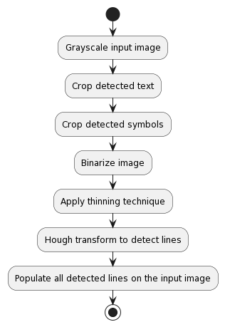
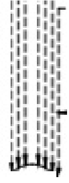
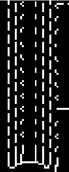

# Line detection design

## Table of contents

- [Line detection design](#line-detection-design)
  - [Table of contents](#table-of-contents)
  - [Considerations](#considerations)
  - [Goal](#goal)
  - [Proposed line detection flow](#proposed-line-detection-flow)
  - [Grayscale input image](#grayscale-input-image)
  - [Crop detected text](#crop-detected-text)
  - [Crop detected symbols](#crop-detected-symbols)
  - [Binarize image](#binarize-image)
  - [Apply thinning technique](#apply-thinning-technique)
  - [Hough transform](#hough-transform)
  - [Line detection](#line-detection)
  - [Merging lines with direction](#merging-lines-with-direction)

## Considerations

- Image quality significantly impacts line detection accuracy. For optimal results, the image should have a minimum resolution of at least 300dp and should be free from blurring or distortion.

- It is crucial to verify that the image file is in the PNG format. If the image is initially in JPG format, it must be converted to PNG before any processing takes place. Ideally, it is preferable to obtain the image in PNG format directly from the source.

- Line sign detection will be not be addressed.

## Goal

Detect and identify line segments (or coordinates) in a continuous format as much as possible. It is important to note that the line detection algorithm will not attempt to merge solid lines that are not continuous. The responsibility for merging such lines and detecting connectivity will lie with the graph construction process. If graph construction cannot address this, then it must be manually addressed by the user. This ensures that all automatic calculations are performed in one place, keeping things simple.

## Proposed line detection flow

User will submit the image PId along with the symbols and text corrected data via the line detection endpoint request. Once the request is submitted a background task would be submitted for the line detection and the user will be notified that the request has been submitted.

The following flowchart depicts the intended implementation of the line detection module, which executes a series of steps sequentially in the background:



Below is a detailed explanation outlining the implementation steps or providing valuable suggestions for effectively managing specific use cases:

## Grayscale input image

In order to enhance processing efficiency and reduce color variations in an image, it is highly recommended to convert the image to grayscale.

For implementation, the following input and output should be considered:

- Input: P&ID image

- Output: Grayscale P&ID image

## Crop detected text

- To reduce noise for the line detection cropping the text from the image will help.

- To ensure a noise-free background color for the cropped text, we should first employ histogram analysis to find the background color. It is essential for precise line detection.

- It has been observed that when cropping large text, line segments may occasionally be unintentionally omitted, resulting in improper connection detection. This will be addressed at the graph refinement stage.

For implementation, the following input and output should be considered:

- Input: JSON file containing detected text (including the text itself and the corresponding bounding boxes) and a grayscale image of a P&ID.

- Output: Cropped image file of the P&ID with the detected text.

## Crop detected symbols

- To reduce noise for the line detection cropping the symbols from the image will help.

- To ensure a noise-free background color for the cropped symbols, we should first employ histogram analysis to figure the appropriate background color. It is essential for precise line detection.

- All identified symbols within the image should be carefully cropped out.

For implementation, the following input and output should be considered:

- Input: Given a JSON file containing detected symbols along with their labels and corresponding bounding boxes, and a grayscale image file of a P&ID with cropped detected text.

- Output: Provide a cropped P&ID image file with the detected symbols.

## Binarize image

Binarization of an image is the process of converting a grayscale or color image into a binary image, where each pixel is either black or white. This is typically done by applying a threshold value to the image pixels, where pixels with intensities below the threshold are set to black, and those above the threshold are set to white.  This technique will simplify image analysis and processing.

- The implementation should incorporate the OTSU thresholding technique. This technique ensures that the thresholding value used to binarize the pixel value remains constant across different images. The effectiveness of this approach was validated through testing with sample images.

**Note:** It is important to acknowledge that OTSU thresholding may not perform optimally when dealing with varying illumination levels in an image, particularly in scanned images. In such situations, adaptive thresholding could be a viable alternative. However, to maintain simplicity and avoid additional parameter configuration, we have chosen to employ OTSU thresholding for the implementation.

- Thinning technique also requires the process of binarization.

For implementation, the following input and output should be considered:

- Input: A grayscaled image file of a P&ID (Piping and Instrumentation Diagram) with symbols and text, which has been cropped.

- Output: A binary image file representing the P&ID.

## Apply thinning technique

Thinning algorithms are commonly used in image processing to extract the skeleton or thin representation of an object within an image. The skeleton represents the essential shape and connectivity of the object while reducing it to a one-pixel wide line. Zhang-Suen a popular algorithm is suggested to be used.

- The thinning algorithm in OpenCV is a valuable component of the extended OpenCV library. To utilize OpenCV's thinning capability, it is necessary to install opencv-contrib-python. It is important to mention that this library includes certain non-free algorithms. Alternatively, one can consider adapting the open library code for execution within a Docker environment. The source code can be found [here](https://github.com/bsdnoobz/zhang-suen-thinning). After careful consideration, we have opted to utilize the extended OpenCV library for our implementation.

- Thinning technique will result in some broken lines based on image quality so consider handling this scenario when trying to merge lines in connectivity analysis.

Input image | Thinning result
:-------------------------:|:-------------------------:
 | 

- Thinning techniques enhance line detection in high-resolution images, yielding improved results. However, they may fail to capture all lines in low-resolution images. To address this, the thinning option should be made configurable, allowing users to choose the appropriate setting based on the specific image quality.

For implementation, the following input and output should be considered:

- Input: Binarized P&ID image

- Output: Thinned P&ID image

## Hough transform

The Hough Transform is a popular algorithm used in computer vision for detecting lines and other shapes in an image. OpenCV provides a HoughLinesP() function that implements the Hough Transform to detect lines in an image. The HoughLinesP() function takes several parameters that can be adjusted to improve the accuracy of line detection. These parameters include:

- rho: Distance resolution of the accumulator in pixels. This parameter determines the distance resolution of the Hough Transform accumulator array, which is used to store the votes for each line.

- theta: Angular resolution of the accumulator in radians. This parameter determines the angular resolution of the Hough Transform accumulator array.

- threshold: The minimum number of votes (intersections in Hough space) required for a line to be detected. This parameter determines the minimum number of votes required for a line to be considered a valid line.

- minLineLength: The minimum length of a line (in pixels) that can be detected. This parameter determines the minimum length of a line that can be considered a valid line.
For the sample images we set it to None but this should be something configured by the user as part of the request.

- maxLineGap: The maximum allowed gap (in pixels) between segments of a line. This parameter determines the maximum gap between segments of a line that can be considered a single line. For the sample images we set it to 2 but this should be something configured by the user as part of the request.

For the implementation below considerations should be taken into account -

- Based on our experimentation, `0.2` for `rho` is a good start. This parameter will be fixed for all images.

- Based on our experimentation, `np.pi/1080` for `theta` is a good start. This parameter will be fixed for all images.

- Based on our experimentation, `5` for `threshold` is a good start but image plays a role. For instance the minimum distance for dashed lines.  This parameter will be fixed for all images but can be adjusted based any future observations.

- The parameters `maxLineGap` and `minLineLength` are crucial for image processing, and it would greatly enhance flexibility if these values could be configured in the request. While these values may not require frequent modification for every image request, the option to adjust them when necessary would be highly beneficial.

- As part of line detection implementation `low threshold`, `rho` and `theta` values can be further optimized if needed.

## Line detection

The Hough transform plays a crucial role in detecting both dashed and solid lines, enabling the generation of their respective coordinates. There is a possibility that a long continous line will be detected as multiple line segments and graph construction will have the logic to figure the connectivity between these line segments.

For implementation, the following input and output should be considered:

- Input: Processed P&ID image file

- Output: List of line segment points (start and end) definitions


Example of the temporary storage file that will be generated for graph construction

```json
{
    "image_url": "pid2.png",
    "image_details": {
      "format": "png",
      "width": 1388,
      "height": 781
    },
      "line_segments": [
          {            
              "startX": 0.5067512555,
              "startY": 0.72654658,
              "endX": 0.5136717032,
              "endY": 0.7377242533
          },
        ...
      ]
}
```

**Note:**

Ensure that the output images are properly indexed and named based on the corresponding step. This naming convention  will greatly facilitate the debugging process.
