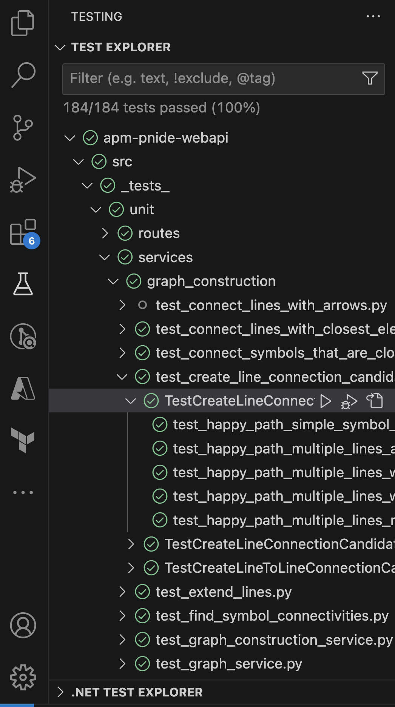
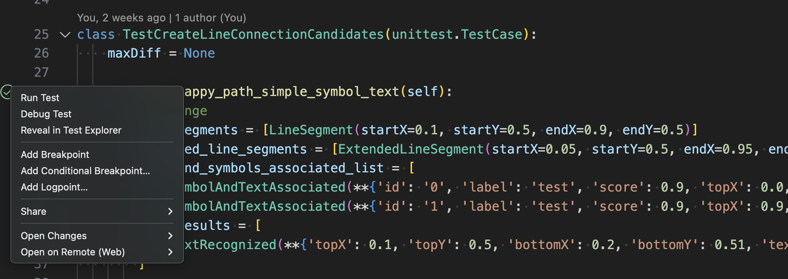

# Developer guide

This section will provide information on the installations/extensions that developers will need to install/examine to be able to run and debug the python modules for the repo.
It also includes relevant information to run the entire inference workflow end-to-end.
Here, we assume that Visual Studio Code will be used as development IDE.

## Table of contents

- [Developer guide](#developer-guide)
  - [Table of contents](#table-of-contents)
  - [Docker Desktop](#docker-desktop)
  - [Dev container VS code extensions](#dev-container-vs-code-extensions)
  - [What is needed to set up the dev container?](#what-is-needed-to-set-up-the-dev-container)
  - [Running the code in VS code](#running-the-code-in-vs-code)
  - [Running unit tests](#running-unit-tests)
    - [Required import order to run tests locally](#required-import-order-to-run-tests-locally)
  - [Local graph database setup](#local-graph-database-setup)
  - [How to run the inference service](#how-to-run-the-inference-service)
    - [Hosting locations](#hosting-locations)
      - [Deployed AKS environment](#deployed-aks-environment)
      - [Locally](#locally)
    - [Making requests to the API](#making-requests-to-the-api)
      - [Postman](#postman)
      - [Swagger](#swagger)

## Docker Desktop

1. Install [Docker Desktop](https://www.docker.com) specific to the machine that will be used for coding.
1. Once the install is complete it may need a machine restart.
1. Open docker desktop and make sure it runs fine.

## Dev container VS code extensions

The Visual Studio Code Dev Containers extension lets developers use a Docker container as a full-featured development environment. It allows devs to open any folder or repository inside a container and take advantage of Visual Studio Code's full feature set

1. In Visual studio code extensions, search for **"Dev Containers"** and install it (extension id `ms-vscode-remote.remote-containers`).
1. In Visual studio code extensions, search for **"Docker"** and install it (extension id `ms-azuretools.vscode-docker`).
1. In Visual studio code extensions, search for **"SQL Server"** and install it (extension id `ms-mssql.mssql`).

## What is needed to set up the dev container?

To create a development (dev) container in VS Code 3 files are to be configured and the code repository should have default ones provided to get started:

1. **devcontainer.json** defines how VS Code should start the container and what to do after it connects.
1. **docker-compose.yml** is used tp define and run multi-container Docker applications.
1. To make and persist changes to the dev container, such as installation of new software, **Dockerfile** will be used.

## Running the code in VS code

1. Run **Docker desktop**.
1. Open the code repository in VS code.
1. When opening the code for first time, the dev container has to be built using **"Dev Containers: Rebuild and Reopen in Container"** command. This command will build the container image with the required packages from the config files discussed earlier. This would take few mins.

1. When editing the contents of the .devcontainer folder, developers need to rebuild for changes to take effect. Use the **"Dev Containers: Rebuild Container"** command from VS code command palette for your container to update. For everything else **"Dev Containers: Reopen Container"** should be used.


1. After a successful rebuild, two containers should be visible in Docker: one container for the SQL Server and another container for the Fast API.
1. The **launch.json** file located in the **.vscode** folder contains the default configurations for starting gunicorn and launching the API at http://localhost:8000/docs.

## Running unit tests

Tests are written using the `pytest` framework - see [the framework documentation](https://docs.pytest.org/en/7.3.x/) for more information.
The library is part of the `requirements.txt` file, and should already be installed if you are using the dev container.

Unit tests for the projects are located in the directory `src/_tests_/unit/`.
Its directory structure mirrors the structure of the project implementation directory `src/app/`.
Unit test filenames follow the convention `test_{filename_to_test}.py` - the `test_` prefix is required for discovery by `pytest`.
The existing tests follow the ["Arrange Act Assert" pattern](https://automationpanda.com/2020/07/07/arrange-act-assert-a-pattern-for-writing-good-tests/), and are good place to start to understand the implementation components and the `pytest` features used.
Each method implemented in a project file has a corresponding class defined as `Test{MethodToTest}(unittest.TestCase)` (or `Test{MethodToTest}(unittest.IsolatedAsyncioTestCase)` where async test cases are needed), and the unit tests are methods in this class.

The file [`.env.test`](../src/.env.test) is used to provide dummy values for the required environment variable configuration.

You can run the tests locally starting from the `src/` directory:

```sh
cd src/
pytest .
```

Running it from `src/` will run all `pytest` tests discovered in child directories - you can specify a folder or filename to further narrow down the tests run via command line.
If you have the VSCode Python extension installed (extension ID `ms-python.python`, which is installed automatically in the dev container), you should also be able to run and debug tests interactively through the built-in test explorer, as the below screenshot shows.



The run/debug options should also be visible within each test file itself:



### Required import order to run tests locally

In the existing test files, you will see a line similar to

```python
sys.path.append(os.path.join(os.path.dirname(__file__), '..', '..', '..', '..'))
```

prior to any import statements that import modules from the `app` directory (with a variable number of `'..'` based on the location of the test file in the directory structure - the number is how many degrees of separation away the file is from the `src/` directory).
Note that this is required due to where tests are run by default locally -
for future tests, if this line isn't present or any import statements try to import from `app.*` before this line, you will run into an `ImportError` when running locally because it can't find the `app` module.

## Local graph database setup

The dev container is configured with the required packages and VSCode extensions to run a local instance of the graph database used for the graph persistence step of the inference workflow.
Detailed instructions on database setup, configuration, and querying via VSCode (there are currently no provided APIs in the inference service for DB querying) are located in [this document](./development_graph_db_setup.md).

## How to run the inference service

### Hosting locations

#### Deploying to AKS environment

The services provided under the `src/` directory can be deployed to the AKS environment via the Azure DevOps pipeline. In this project, AKS can be used to host the inference service. For more information on how to deploy the inference service to AKS, please refer to [this tutorial](https://learn.microsoft.com/en-us/azure/aks/tutorial-kubernetes-deploy-application?tabs=azure-cli).

#### Locally

See the [instructions in `src/README.md`](../src/README.md#running-locally) for information on how to run the inference service locally.
[This document](./local_development_setup.md) (also linked in the above `README`) has more details on how to set up your local developer environment to be able to run and test the code.

Note that this option is preferred for the local development and testing loop - stable releases should be deployed to the AKS Dev/QA/Prod environments per the standard process, and those endpoints should be used by most non-developer end users to interact with the service.

### Making requests to the API

#### Postman

The [Postman](https://www.postman.com/) collection has been provided [here](./postman/PID_Digitization.postman_collection.json) for your convenience in making requests against the inference service - you can import this into your local Postman environment to get started.
Note that you will also need to import all of the [environments](./postman/environments/PID_Digitization_Web_API_Local.postman_environment.json), as the routes will vary based on whether you are running it against the local, dev, or QA environment.
If additional environments are added, you will need to add those routes to Postman as well in this way.
The routes and request bodies have the field names pre-populated and you just need to update them with the input as specified in the sections of this document above to run the inference workflow for a given P&ID, or perform easy testing to validate an endpoint.

#### Swagger

The inference service has an auto-generated Swagger UI - you can visit it by visiting `{base-inference-service-url}/docs`.
This UI provides an easy interface to visualize all the endpoints, and by clicking "Try it out" on an endpoint, you can fill in the requisite fields and make HTTP requests against the inference service in the same way that Postman does.
The YAML definition of this is stored [here](./webapi-swagger.yaml) - if the endpoints are updated, be sure to update this documentation as well.