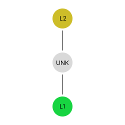

# Process Flow Design <!-- omit in toc -->

## Table of Contents

- [Table of Contents](#table-of-contents)
- [Disclaimer](#disclaimer)
- [Goal](#goal)
- [Assumptions](#assumptions)
- [Steps](#steps)
  - [Arrow to Sources Association](#arrow-to-sources-association)
  - [Flow Direction Propagation](#flow-direction-propagation)
    - [Legend](#legend)
    - [Implementation Logic](#implementation-logic)
    - [Example Ouptut](#example-ouptut)
  - [Graph Traversal](#graph-traversal)
    - [Graph Traversal Case 1](#graph-traversal-case-1)
    - [Graph Traversal Case 2](#graph-traversal-case-2)
    - [Graph Traversal Case 3](#graph-traversal-case-3)
    - [Graph Traversal Case 4](#graph-traversal-case-4)
- [Example Output](#example-output)
  - [Output](#output)
- [Solution Pseudocode](#solution-pseudocode)
- [Open Questions](#open-questions)


## Disclaimer

This document relies on prior knowledge from a few other design documents.
Before reading this design document, ensure you have a good understanding of [the graph construction design](./graph-construction-design.md) and [the arrow direction design](./arrow-direction-detection-design.md).

## Goal

The goal of process flow is to understand the flow relationship between equipment and connectors.

## Assumptions

By this point, the entire graph exists with all the connections.

## Steps

There are several steps that are required to propagate the necessary information throughout the graph.

1. Arrow to Sources Association
1. Flow Direction Propagation
1. Graph Traversal

### Arrow to Sources Association

<div align="center">
    
</div>

<p align="center">
Fig. 1.1: Line L2 is the line associated with the arrow symbol since L2 is closer to the center of the side it intersects.
</p>


In the arrow direction design, there is a concept of choosing a single line (out of the list of lines) that is used to assign arrow direction.
Instead of using the arrow direction, the line that is associated with the arrow (to understand direction) should be the line that connects to the base of the arrow symbol.
In the case of the figure above, the line that is associated with the arrow (or the arrow's initial source) is L2.

For all the arrow nodes, the initial source needs to be established.
Once there is an understanding of the initial source for the arrow node, a new property is added to the arrow node.
The property is called `sources` and is set to the id of the source line.
In the example above, the arrow node's object may look like the following.

```json
{
    "id": "arrow-1",
    "type": "symbol",
    "label": "arrow",
    "sources": ["L2"],
    "arrow_direction": "<arrow_direction>"
    ...
}
```

### Flow Direction Propagation

#### Implementation Logic

To this point, only the arrows have the concept of a `sources`.
To ensure all objects on the process flow line have the correct flow direction such that incorrect traversal paths cannot happen, the propagation of the flow direction needs to be passed through all the objects on the process flow line.
To pass through the flow direction, the connections of equipment and connectors to other equipment and connectors must be known.
There is one other scenario that must be accounted for.
When there is a `T-intersection` like the one below, the incorrect flow direction can be propagated.


The `T-intersection` must also be handled as a stopping symbol to limit the spread of incorrect flow direction through the lines and symbols.
A `T-intersection` is **only** a stopping symbol if the previous node to the arrow symbol is the arrow's source and the count of the lines the arrow is connected to is greater than 2.
The logic to get the valid `T-intersection` arrows can be followed below:

```python
# assuming that the check that the previous node is in the sources of the arrow is done
node_id, node_data = ... # the id and node of the current node in the traversal

# if the node's label is not an arrow we return
if node_data['label'] != config.arrow_symbol_id:
    return None

# if not direction is set we return
if node_data['direction'] == Direction.unknown:
    return None

# if the degree is less than 3 we return
if G.degree(node_id) < 3:
    return None

# check if there are at least 3 line neighbors
num_lines = 0
neighbors = G.neighbors(node_id)
for neighbor in neighbors:
    # check if the neighbor is a line
    neighbor_node = G.node(neighbor)
    if neighbor_node['type'] == NodeType.line:
        num_lines += 1

if num_lines > 2:
    # here we can stop as we assume the arrow should be a T-intersection
    return node_id
```

When an equipment or connector is connected to an equipment, connector, or arrow (at a T-intersection), the flow direction between the connected symbols is propagated throughout all the visited lines and symbols between the equipment/connector connection.
If the graph is correct going into the propagation step, all of the process lines should have the correct direction for all lines and symbols on the line between the connected equipment, connectors, and arrows.

To get the connections between equipment, T-intersection arrows, and connectors, breadth-first-search (BFS) is used.
When using BFS to find the connected components, traversal starts at the equipment and connectors.
If an equipment, connector, or T-intersection based on the logic above is seen when traversing the graph, traversal stops, and the equipment and the visited nodes are added to a list of connections for the starting node.
If a sensor is seen, traversal stops, and that specific traversal path does not continue.
If a valve is seen (even if the valve is an asset), traversal continues.
For all other traversal paths, the visited set (the set of objects between the start and end equipment/connector), the starting equipment/connector, and the ending equipment/connector are returned (i.e lines, valves, fitting etc. fall into the "set of objects category").

After the connections are created we should have the definition of all equipment and connectors that are connected (as well as the flow direction and the list of objects that connect the equipment/connectors).
With this data, the propagation of flow direction can begin.
With the visited set, the list of object ids should be ordered, so the logic to propagate is pretty straightforward.
An example of the logic can be seen below:

```python
"""
Assuming equipment_and_connector_symbol_connections looks like the following:
{
    'equipment_id_1': {
        'visited_ids': ['line_id_1', 'symbol_id_1', ...],
        'node_id': 'connector_id_1'
    },
    'connector_id_1': {
        ...
    }
}

Where the key of the object is either a connector or an equipment and node_id references either a connector or an equipment.

None of the ids in the visited_ids list reference a connector or equipment id.
"""

for symbol_node_id, connected_nodes in equipment_and_connector_symbol_connections.items():
        for connected_node in connected_nodes:
            # check if the flow direction is unknown
            if connected_node['flow_direction'] == FlowDirection.unknown.value:
                continue

            last = symbol_node_id
            for visited in connected_node['visited_ids']:
                graph_service.get_node(visited)['temp_sources'].add(last) # assuming initialized earlier
                last = visited

            graph_service.get_node(connected_node['node_id'])['temp_sources'].add(last)
```

After the propagation step, the temp flow direction should be established for all subpaths in the graph.
The temp flow direction is in place as there are possible scenarios where a segment becomes untraversable (NOTE: the mentioned scenario is very rare as a specific scenario has to arise where a T-intersection arrow is unknown, but the direction is known before the arrow for at least 2 of the paths).
An untraversable segment is a segment where the count of the source lines is equal to the degree (or number of connections) of the segment.
In these scenarios, the sources are not updated to the `temp_sources` and just maintains the current sources.
In most cases, this means that the sources is the empty set.

### Graph Traversal

In the design for [graph construction](./graph-construction-design.md), breadth-first-search (BFS) is performed to associate the terminal symbols with each other.
With flow direction added to all objects on the process flow line, the flow direction needs to be integrated into the traversal path.
There are several traversal path cases to discuss.

The following figure is used to explain the different cases.


**NOTE(\*):** In the samples below, the start node is the green node and the end node is the yellow node.

**NOTE(\*\*):** All the examples below leverage the arrow as the control of the flow direction.
By this point, anything on the process flow should have the concept of a `sources`, so this logic also applies to all symbols and lines.

**NOTE(\*\*\*):** Only the downstream flow direction is applied.
Anytime the traversal path is moving upstream, the traversal logic should stop.

#### Graph Traversal Case 1


**Traversal Path:** L1 -> L2 + L2 -> L1

**Setup:** In this case, `L1` is the start position for BFS, and the Arrow's source is `L1`.

In this case, the start node is `L1`.
The first pass of BFS from `L1`, the neighbor, `Arrow`, is discovered with a `sources` property set to `L1`.
Since we came from `L1` and the `sources` is `L1`, momentum moving downstream.
A variable named `momentum` is set to `downstream`, and the neighbors are explored.
`L2` is the next neighbor, and momentum is still set to `downstream`, so it's safe to assume that `L2` is downstream from `L1`.

**Expected Output**

```
L1 > L2
```

#### Graph Traversal Case 2


**Traversal Path:** L1 -> L2 + L2 -> L1


**Setup:** In this case, `L1` is the start position for BFS, and the Arrow's source is `L2`.

In this case, the start node is `L1`.
In the first pass of BFS from `L1`, the neighbor, `Arrow`, is discovered with a `sources` property set to `L2`.
`L1` does not equal the `sources`, so no moment is set.
`L2` is seen as the next neighbor and the arrow's `sources` is `L2`, so the momentum is set to `upstream`.

**Expected Output**

```
L2 > L1
```

#### Graph Traversal Case 3



**Traversal Path:** L1 -> L2 + L2 -> L1

**Setup:** In this case, `L1` is the start position for BFS, and the Arrow's source is `unknown`.

In this case, the start node is `L1`.
In the first pass of BFS from `L1`, the neighbor, `Arrow`, is discovered with a `sources` property set to `unknown`.
`L1` does not equal the `sources`, so no moment is set.
`L2` is seen as the next neighbor and is not equal to the arrow's `sources`, so no momentum is set.

**Expected Output**

```
L1 - L2
L2 - L1
```

#### Graph Traversal Case 4

**Traversal Path:** L1 -> L2 + L2 -> L1


**Setup:** In this case, `L1` is the start position for BFS, and the Arrow's source is `L3`.

In this case, the start node is `L1`.
In the first pass of BFS from `L1`, the neighbor, `Arrow`, is discovered with a `sources` property set to `L3`.
`L1` does not equal the `sources`, so no moment is set.
`L2` is seen as the next neighbor and is not equal to the arrow's `sources`, so no momentum is set.

**Expected Output**

```
L1 - L2
L2 - L1
```

## Solution Pseudocode

The code below is an example update to BFS to add the momentum logic.
This logic will be incorporated into the existing traversal logic for graph traversal.

```python
def _traverse_for_object_connections(
    G: nx.Graph,
    start_node: str,
    asset_symbol_ids: set[str],
    should_exhaust_paths: bool,
    use_traversal_connection_visisted_ids: bool = False
):
    queue = []
    queue.append(TraversalConnection(node_id=starting_node, flow_direction=FlowDirection.unknown))
    visited = {starting_node}
    connected_objects = []

    while queue:
        traversal_connection = queue.pop(0)
        s = traversal_connection.node_id
        flow_direction = traversal_connection.flow_direction
        current_visited_ids = traversal_connection.visited_ids

        neighbors = list(self.G.neighbors(s))
        for neighbor in neighbors:
            if (use_traversal_connection_visisted_ids and neighbor in current_visited_ids) or \
                    (not use_traversal_connection_visisted_ids and neighbor in visited):
                continue

            if neighbor not in asset_symbol_ids:
                    visited.add(neighbor)

            new_visited_ids = current_visited_ids.copy()
            new_flow_direction = flow_direction
            node = self.G.nodes[neighbor]

            last_node = self.G.nodes[s]

            # check if moving upstream instead of downstream
            # if moving upstream, stop the traversal path
            if 'sources' in last_node and neighbor in last_node['sources']:
                # flow direction is upstream... continue and do not add neighbor
                logger.warn('moving upstream... Terminating traversal branch')
                continue

            # case when the node is a line
            if node['type'] == GraphNodeType.line:
                if 'sources' in node and s in node['sources']:
                    new_flow_direction = FlowDirection.downstream

                new_visited_ids.append(neighbor)
                queue.append(TraversalConnection(node_id=neighbor, flow_direction=new_flow_direction, visited_ids=new_visited_ids))

            # case when the node is a symbol
            elif node['type'] == GraphNodeType.symbol:
                # case when the node is an asset symbol
                if neighbor in asset_symbol_ids:
                    connected_objects.append(
                        TraversalConnection(node_id=neighbor, flow_direction=new_flow_direction, visited_ids=new_visited_ids)
                    )
                    continue

                # case when the node is an arrow and the last symbol is a line which is the source line of the arrow
                if 'sources' in node and s in node['sources']:
                    new_flow_direction = FlowDirection.downstream
                    # here we need to check if the node is an arrow
                    # if so, we can check if it's in the set of arrows that are junctions
                    # if it is, and we are in the pass for the propagataion, we can stop and add to the connections

                new_visited_ids.append(neighbor)
                queue.append(TraversalConnection(node_id=neighbor, flow_direction=new_flow_direction, visited_ids=new_visited_ids))

    return connected_objects
```

## Open Questions

1. In the case below, should the vertical lines have a known direction to them?

    

    ```
    result:
        T1 - T3
        T3 - T1
        T2 > T1
        T2 > T3
        T1 < T2
        T3 < T2

    where:
        - = no flow direction
        > = downstream flow direction
        < = upstream flow direction
    ```

    Solution: Keep the output the same like this.

1. Does flow direction only matter for equipment-to-equipment relationships or any relationship (symbol-to-equipment or symbol-to-symbol)?

    Solution: Equipment-to-equipment and equipment-to-symbol (typically just equipment and valves).

1. In the case of equal or unequal opposing flow directions, would you rather stop or continue?

    

    ```
    result options:
        option 1:
            T1 - T2
            T2 - T1
        option 2:
            undefined (Stop at the first opposite flow direction)
        options 3:
            undefined (See equal upstream and downstream flow direction)
    where:
        - = no flow direction
    ```

    Solution: Decide to use option 2.