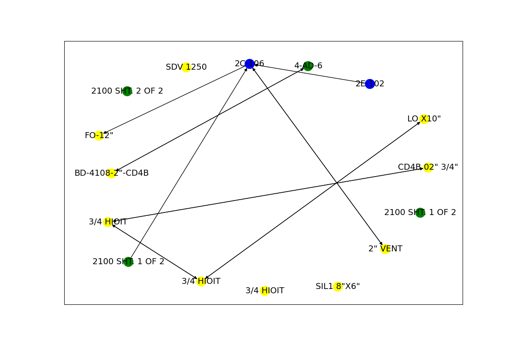
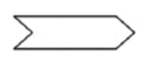

# User guide to the inference service

This document is intended to be a guide for end users of the inference service of the P&ID digitization project.
Here, we walk through the typical user flow, ways to run and make requests against the service, and high-level guidance for troubleshooting results.

## Table of contents

- [User guide to the inference service](#user-guide-to-the-inference-service)
  - [Table of contents](#table-of-contents)
  - [Introduction](#introduction)
  - [Prerequisites](#prerequisites)
    - [Important notes](#important-notes)
  - [Steps](#steps)
    - [Symbol detection endpoint](#symbol-detection-endpoint)
      - [Symbol detection input](#symbol-detection-input)
      - [Symbol detection output](#symbol-detection-output)
        - [JSON](#json)
        - [Image](#image)
      - [Symbol detection configuration options](#symbol-detection-configuration-options)
      - [Troubleshooting symbol detection](#troubleshooting-symbol-detection)
        - [Known bugs or issues with symbol detection](#known-bugs-or-issues-with-symbol-detection)
    - [Text detection endpoint](#text-detection-endpoint)
      - [Text detection input](#text-detection-input)
      - [Text detection output](#text-detection-output)
        - [JSON results](#json-results)
        - [Image (debug and output)](#image-debug-and-output)
      - [Troubleshooting text detection](#troubleshooting-text-detection)
        - [Text detection configuration options](#text-detection-configuration-options)
        - [Known bugs or issues with text detection](#known-bugs-or-issues-with-text-detection)
    - [Graph construction endpoint](#graph-construction-endpoint)
      - [Components](#components)
        - [Line detection step](#line-detection-step)
        - [Graph creation step](#graph-creation-step)
        - [Job status](#job-status)
      - [Graph construction input](#graph-construction-input)
      - [Graph construction output](#graph-construction-output)
        - [JSON outputs](#json-outputs)
          - [`response_line-detection.json`](#response_line-detectionjson)
          - [`response_arrows_line_source.json`](#response_arrows_line_sourcejson)
          - [`response_graph-construction.json`](#response_graph-constructionjson)
        - [Images](#images)
          - [Line detection debug and output images](#line-detection-debug-and-output-images)
          - [Graph creation debug and output images](#graph-creation-debug-and-output-images)
      - [Troubleshooting graph construction](#troubleshooting-graph-construction)
        - [Graph construction configuration options](#graph-construction-configuration-options)
          - [Line detection options](#line-detection-options)
          - [Graph creation options](#graph-creation-options)
        - [Known bugs or issues with graph construction](#known-bugs-or-issues-with-graph-construction)
    - [Graph persistence endpoint](#graph-persistence-endpoint)
      - [Graph persistence input](#graph-persistence-input)
      - [Graph persistence output](#graph-persistence-output)
      - [Graph persistence configuration options](#graph-persistence-configuration-options)
  - [Accessing inference results](#accessing-inference-results)

## Introduction

The goal of the inference service is to convert a user-provided piping and instrumentation diagram (P&ID) image to a graph format, where the nodes in the graph represent the assets in the diagram (labeled with the associated text provided in the diagram) and the edges represent the connections between assets.
The assets currently include equipments, pagination connectors, valves, and sensors, all of which need to have an associated alphanumeric identifier.

The complete user flow consists of four endpoints that are run sequentially - symbol detection, text detection, graph construction (which includes line detection and building the graph using a candidate matching algorithm), and graph persistence.
The format of the output generated in each step is chained as the input to the subsequent step.*
This request structure was chosen to facilitate manual corrections via user input at each step - these corrections are encouraged and likely necessary to achieve the most accurate results due to the natural variability of the machine learning models leveraged in the project and potential edge cases for the heuristic graph construction approach.

*Note that graph construction is a long-running task, so, in contrast to the first two endpoints where the response JSON is returned to the user as soon as call completes, the required graph construction output for the next call to the graph persistence endpoint will need to be queried via `GetInferenceResults` once the graph construction job completes.
This will be discussed in more detail in the relevant sections below.

## Prerequisites

The following prerequisites are required for the inference service to run:

- All necessary supporting Azure resources have been deployed to the environment - for the full description of the required infrastructure, please see the main architecture diagram [here](./architecture.md#high-level-architecture).
- A trained model for symbol detection must be deployed to an AML online endpoint that the inference service is able to access - for overall documentation for the symbol detection, please see [here](https://github.com/Azure-Samples/MLOpsManufacturing/tree/main/samples/amlv2_pid_symbol_detection_train)
- All required environment variables are properly set.

### Important notes

**The inference service will provide best results with high-resolution images.**
If an image is blurry to human sight when you zoom in on it, text detection in particular, but all the components to a lesser extent, will have a difficult time and more manual corrections will be required for an accurate P&ID graph.

## Steps

### Symbol detection endpoint

As part of symbol detection, the service takes a user-provided P&ID image and submits it to the deployed object detection model endpoint in Azure Machine Learning (AML).
The model returns the bounding boxes of the detected symbols, along with its confidence score for each detection;
the service takes this result and returns all detected symbols that have an associated confidence score above the [configured threshold](#symbol-detection-configuration-options).

#### Symbol detection input

**Endpoint**: `/api/pid-digitization/symbol-detection/{pid_id}`

**Be careful when specifying the `pid_id` for an image** - this will be used to name the storage account folder containing all input data, requests, and responses for this P&ID across the entire inference workflow, and you will need to use it when making requests to subsequent endpoints.
Using a `pid_id` that has already been used will overwrite the information, including debug images and persisted graph data, that has already been generated in stored.

The symbol detection takes its input in `form-data` format due to the need to upload an image file.
Required user input:

- `file`: The P&ID image to digitize. **This needs to be given in PNG or JPEG format - any other image formats are currently unsupported.**
- `bounding_box_inclusive_str`: If your P&ID includes legends, it is best to provide the bounding box of just the diagram here to ensure the process is not slowed down due to detection of unnecessary symbols, text and lines in the legends.
The diagram is the only thing that can be processed meaningfully in the current solution.
  This should be provided as a JSON string with the following format: {"topX": 0.0, "topY": 0.0, "bottomX": 1.0, "bottomY": 1.0}.

  **The coordinates need to be normalized to the range [0, 1].**
  You can find the raw coordinates by opening the image in an image-viewing application such as MS Paint and seeing the coordinates of your mouse cursor.
  You normalize the coordinates by dividing the `x`-values by the image width and the `y`-values by the image height (image size is typically given as `image width` x `image height`).

Note that this is the only endpoint in which you need to upload the P&ID image file as input.
The controller uploads it to blob storage and subsequent endpoints will reference that image by the `pid_id`.

#### Symbol detection output

##### JSON

Symbol detection returns a JSON object containing a list of all detected symbols and their coordinates, as well as some basic details about the image and the input bounding box to consider.

The list of detected symbols (named `label`) looks like

```json
"label": [
    {
      "topX": 0.1,
      "topY": 0.1,
      "bottomX": 0.15,
      "bottomY": 0.15,
      "id": 0,
      "label": "Instrument/Indicator/Field mounted discrete indicator",
      "score": 0.85
    },
    ...
  ]
```

where

- `topX`, `topY`, `bottomX`, and `bottomY` are the normalized coordinates of the bounding box of the symbol (`topX`, `topY`) is the top left-hand corner, (`bottomX`, `bottomY`) is the bottom right-hand corner)
- `label` is the unique three-part concatenated string for the symbol class - full list [here](https://github.com/Azure-Samples/MLOpsManufacturing/blob/main/samples/amlv2_pid_symbol_detection_train/docs/symbols_nomenclature_hirerarchy.md).
  Note that these labels cannot be changed within the inference service - these are received from the model.
  All changes to label hierarchy need to be done to the model to be reflected in this output, i.e. any change you make here won't carry forward to other diagrams.
- `score` is the confidence of the object detection model for this item
- `id` is an auto-generated unique ID for the detected symbol and doesn't correspond to any other IDs for the symbol label.

##### Image

The service also outputs the P&ID image annotated with the detected symbol bounding boxes to blob storage.
To retrieve this image, make a call to `GetInferenceResultImages` (route is `/symbol-detection/{pid_id}/images`), replacing `pid_id` with the ID you specified in the symbol detection request.


#### Symbol detection configuration options

Relevant variables:

- `inference_score_threshold` [ENV]: the threshold for the confidence score returned by the symbol detection model. A higher value for the confidence score implies that the model has a higher degree of confidence in the detection result. Increase this value to reduce the number of symbols returned by this service to only the symbols the model is most confident about; reduce this value to return a larger amount of symbols (but it may be a noisier output).
- `symbol_overlap_threshold` [ENV]: the overlap threshold to invoke a score comparison to prune out symbols in symbol detection.
  I.e. if two bounding boxes have a significant overlap (as in the symbol detection model may be detecting the same symbol twice), we will prioritize the symbol with the higher confidence score.
  If you are still seeing that symbols are being detected more than once, try reducing this value.

#### Troubleshooting symbol detection

If you look at the output image and don't see a bounding box around a symbol that you expect to be detected:

- Try lowering the `inference_score_threshold` to see if it gets detected with a lower confidence score.
- Work with a science team to augment the training data to help the model recognize that symbol.

If symbols are being detected from the legend of the diagram:

- Make sure to specify the [`bounding_box_inclusive` parameter](#symbol-detection-input) to specify only the area on the image containing the P&ID itself.

### Text detection endpoint

In this step, the service sends the P&ID image to an optical character recognition (OCR) API exposed by Azure AI Document Intelligence, with the goal of getting the bounding boxes of all text in the image.
These text boxes are then correlated with the symbols recognized in the previous step, and the service returns both all the text recognized in the image as well as the list of all recognized symbols, including the alphanumeric text associated with each symbol.

#### Text detection input

**Endpoint**: `/api/pid-digitization/symbol-detection/{pid_id}`

The text detection service will take the JSON result of the previous symbol detection call as its input, with any manual corrections you made.
Make sure to use the same `pid_id` used to run symbol detection on this image so that the service is able to properly access the original image.

#### Text detection output

##### JSON results

Text detection returns the detected text in two ways in the JSON output: it returns a list of all the text detected by Azure AI Document Intelligence's Read OCR model in `all_text_list`, and another list of all the symbols (taken from the input to this endpoint) with the text, if any, associated with each symbol in `text_and_symbols_associated_list`.
**Any manual correction to the text recognized should be made to `text_and_symbols_associated_list`**, since that is used for asset data as part of graph construction later in the workflow.

`all_text_list` contains, unprocessed, all the bounding boxes of text recognized via OCR.
**This JSON should not be manually edited.**
This is used in line detection, the next step of the inference workflow, since the preprocessing for that requires removing all detected symbols and texts to reduce the amount of noise before the line detection heuristic is applied.
An example of an element in this list, including the bounding box and text string recognized:

```json
"all_text_list": [
    {
      "topX": 0.12,
      "topY": 0.12,
      "bottomX": 0.13,
      "bottomY": 0.125,
      "text": "PG-123"
    },
    ...
  ]
```

`text_and_symbols_associated_list` contains the results of the symbol-to-text correlation, which is implemented using the [`shapely`](https://shapely.readthedocs.io/en/stable/manual.html) Python library.
It does this by evaluating the text polygon and a symbol polygon - if the area of overlap between the two polygons is sufficiently high (i.e. we can infer that the text is within the image, as for a sensor) or the distance between the two is within a configurable threshold (i.e. we can infer that the text should be associated with that symbol, as a valve might have), we can conclude that those elements should be associated.
Note that multiple text bounding boxes (as returned by the Document Intelligence OCR model) may be associated with a single symbol if all of those are within the symbol (i.e. in the above JSON example, if "PG-" and "123" were detected as separate bounding boxes but still within a symbol, the logic in the service would combine those to result in a single associated string for that symbol).

An example of an element in this list:

```json
"text_and_symbols_associated_list": [
    {
      "topX": 0.1,
      "topY": 0.1,
      "bottomX": 0.15,
      "bottomY": 0.15,
      "id": 0,
      "label": "Instrument/Indicator/Field mounted discrete indicator",
      "score": 0.85,
      "text_associated": "PG-123"
    },
    ...
]
```

Before proceeding to the next step, **ensure you review all the text in this section of the response and quickly fix any obvious errors**.
Also, if the `text_associated` is immaterial for a given symbol, feel free to set it to `null`.

##### Image (debug and output)

This step generates two annotated images to reflect the JSON output described above on the P&ID image.

The **output** image (always output) is located at `<inference_results_container>/<pid_id>/text-detection/output_<pid_id>_text_detection.png`.
It is the P&ID image annotated with the contents of the `text_and_symbols_associated_list` JSON output and shows all detected symbols with their associated alphanumeric text as determined by the text detection service.

**These should still be manually reviewed**, as the presence of alphanumeric text doesn't guarantee correctness of the text.
It highlights in red the symbols that should have alphanumeric text (per the `symbol_label_prefixes_with_text` configuration) but have not been associated with any by the text detection service.
It will not highlight:

- symbols that are not part of `symbol_label_prefixes_with_text`
- symbols where the recognized text is invalid  (i.e. where it was only associated with something like `2"x5"`)
- symbols without any text

The **debug** image (only output if the `DEBUG` env variable is set to true) is located at `<inference_results_container>/<pid_id>/text-detection/debug_<pid_id>_text.png` and displays the contents of `all_text_list` as labelled bounding boxes on the P&ID image.

#### Troubleshooting text detection

##### Text detection configuration options

Config that might affect the performance of the OCR:

- `enable_preprocessing_text_detection`: The main caveat with the text detection service is that we are simply consuming the Read OCR model of the Azure AI Document Intelligence Service -
this model is pre-trained and has fairly good results with recognizing text in engineering diagrams when using their high-resolution mode, but we don't have fine-grained control over any model parameters or the ability to force any output formatting at runtime.
The only thing within our control is the input image.
We have the option of performing minor image pre-processing before sending the image to the OCR model - this can be turned on/off with this env variable.
Currently this only performs a grayscale conversion and binarization;
this has been provided as an initial placeholder and more advanced pre-processing logic can be implemented in the future based on the characteristics of the P&ID images typically seen and observed patterns of performance of the text detection OCR model.

Config that might affect the performance of the symbol-to-text correlation:

- `symbol_label_prefixes_with_text` [ENV]: this sets the list of symbol prefixes to enumerate the symbol classes for which we expect alphanumeric text - by default this is all equipments, instruments (sensors and valves), and pagination connectors.
  Only text recognized by the OCR model that contains at least one letter and one number will be associated with symbols of these classes.
  Symbols that don't fall under these categories will not be associated with text.
- `text_detection_area_intersection_ratio_threshold` [ENV]: this sets the required threshold for text/symbol polygon overlap for the text to be considered within the symbol - only text boxes within the symbol are concatenated.
  This default is 0.8 (80% overlap) - increasing this may fail to pick up some text (as the required overlap is higher), and decreasing this might pick up more noise.
- `text_detection_distance_threshold` [ENV]: this is the normalized distance threshold for associating text outside of a symbol with that symbol - increasing this may pick up more noise in crowded images, while decreasing this may leave out some nearby text that is relevant.

`text_detection_area_intersection_ratio_threshold` and `text_detection_distance_threshold` may need to be tuned based on the observed characteristics (how crowded they are, how close text/symbols are, etc.) in the P&IDs you work with.

##### Known bugs or issues with text detection

- Bounding boxes and text returned by Document Intelligence may not align exactly with all of the text associated with a symbol - the text could get split up across multiple bounding boxes, or one bounding box may capture multiple symbols text.
  Additionally, symbols/lines can sometimes be detected as text (i.e. valve as X).
  As discussed earlier, we don't have that much control over how this pre-trained model does the detection and the bounding box output format, so any issues like this would need to be manually corrected.
- **High-resolution images are preferred**;
  OCR performance is worse on low resolution images.
  If the lines and/or text on the image are blurry to human sight when you zoom in, it is almost guaranteed that the OCR will return some inaccurate results and will need to be corrected.

### Graph construction endpoint

The graph construction endpoint contains most of the complex business logic for actually putting together the graph based on the processing done in prior steps.
Internally, this endpoint handles both line detection via the OpenCV implementation of the Hough transform algorithm and graph creation via our custom candidate matching and process flow detection algorithms.
This is discussed in greater detail below.

#### Components

##### Line detection step

The purpose of the line detection step is to detect all line segments on a P&ID image.
We do so by first filtering out all symbols and text detected in the previous workflow steps, in order to minimize noise in the lines detected.
We then apply some minor pre-processing on the image: grayscale and binarization occur in the same way as in text detection, and we additionally perform line thinning using the OpenCV implementation of the Zhang-Suen thinning algorithm.
Finally, we use the OpenCV implementation of the Hough Transform algorithm for object detection to get the list of line segments in the image -
note that there are several configurable parameters for this that can be fine-tuned based on the characteristics of the P&IDs typically seen and observing the results with the defaults.
We'll discuss those in greater detail [below](#line-detection-options).

##### Graph creation step

In the graph creation step, the line segments from the line detection step and the results from text detection are used to build an in-memory graph.
The in-memory graph is used to create the final output which contains all the assets and the connections that each asset has to other assets.
The connections are only the **downstream** or **unknown** connections.
A **downstream** connection is a connection where two assets are connected following the flow of the arrow(s) or propagated arrow information from the source symbol.
An **upstream** connection is a connection where two assets are connected following against the flow of the arrow(s) or propagated arrow information from the source symbol.
An **unknown** connection is a connection where two assets are connected without any flow direction between the connected assets.

The steps graph construction takes to convert the line segment data and text detection data to the final output are the following:

- **Line Extending:** The lines from the line detection step are copied and extended.
- **Text Pruning:** The detected text from text detection that is outside of the main PID content area is removed.
- **Add nodes to the graph:** Initializes an in-memory graph and creates nodes for the lines and symbols.
- **Line candidate matching:** Creates a dictionary to assign the closest line/text/symbol to the line start and end positions. There are different threshold values to control the minimum distance a line start or end point can connect to a line/text/symbol.
- **Connect lines to candidates:** Creates an edge between the line and the top connection candidate for the start and end position of the line. If the candidate is text, a new line node is created, and the edge is created between the line and the new node.
- **Connect close symbols:** Creates an edge between symbols that are close. Symbols are only eligible to be connected to other symbols if the degree of the symbol (the number of connections) is less than 2 or the symbol is equipment, the symbols are within a specified distance threshold, and the x-axis or y-axis has a high enough overlapping region.
- **Arrow Orientation Analysis:** Leverages heuristics to understand the orientation of the arrow and assigns the source of the arrow. The source is used to understand the direction of traversal with traversing the graph.
- **Traversal and Output Generation:** Propagates the flow direction through the process flow lines, finds the assets that are connected in the in-memory graph that are downstream or unknown using the constrained paths after propagation, and generates the final output.
  Assets are symbols that have a label that is equipment, connector, or an instrument that has alpha-numeric text.

##### Job status

Note that unlike the symbol and text detection endpoints, this endpoint follows the [asynchronous request-reply](https://learn.microsoft.com/en-us/azure/architecture/patterns/async-request-reply) pattern instead due to the multi-step, long-running nature of the logic in this endpoint.

Making a request to this endpoint submits a job to the queue -
if there is already an in-progress job for this `pid_id`, the endpoint will return a `409 Conflict`;
otherwise, the immediate response to a user is just a `202 Accepted`.

The service updates the job status (stored in Blob Storage) as it moves through the steps of line detection and graph construction -
this can be queried with the `GetJobStatus` endpoint (via `GET /graph-construction/{pid_id}/status`).
When the job status reaches `Success`, that means that the processing is complete and the results are ready for the next step of graph persistence.

#### Graph construction input

**Endpoint**: `/api/pid-digitization/graph-construction/{pid_id}`

The graph construction service will take the JSON result of the previous text detection call as its input, with any manual corrections made.
Make sure to use the same `pid_id` used to run text detection on this image so that the service can properly access the original image.

There are a few additional parameters in the request body that are used to tune the output results if necessary.
The parameters are:

```json
{
  "hough_threshold": <hough_threshold>,
  "hough_min_line_length": <hough_min_line_length>,
  "hough_max_line_gap": <hough_max_line_gap>,
  "hough_rho": <hough_rho>,
  "hough_theta": <hough_theta>,
  "thinning_enabled": <thinning_enabled>,
  "propagation_pass_exhaustive_search": <propagation_pass_exhaustive_search>
}
```

#### Graph construction output

##### JSON outputs

As mentioned [earlier](#job-status), this endpoint follows the async request-reply pattern and will only return `202 Accepted` with a quick message

```json
{
  "message": "Graph construction job submitted successfully."
}
```

directly to the user if there isn't already an in-progress job for the specified `pid_id` (and a `409 Conflict` if there is).
However, the final graph (as well as a few intermediate results) are also generated and stored in JSON format during this process.

###### `response_line-detection.json`

This is an intermediate response JSON that contains a list of all line segments detected by the Hough Transform in the line detection step.
It also includes the image details and the total count of all the line segments (in `line_segments_count`) for debugging purposes - the more line segments there are, the longer the candidate matching in graph creation will take.

The list of line segments is pretty much exactly what it sounds like:

```json
"line_segments": [
  {"startX": 0.2762128325508607,
  "startY": 0.08419689119170984,
  "endX": 0.9992175273865415,
  "endY": 0.08419689119170984},
  ...]
```

Each line segment is described by the X and Y coordinates of its start and end points.

###### `response_arrows_line_source.json`

```json
[
  {
    "type": "symbol",
    "topX": 0.4550938267,
    "topY": 0.1401508281,
    "bottomX": 0.4660359212,
    "bottomY": 0.1558277181,
    "id": 14,
    "label": "Piping/Fittings/Mid arrow flow direction",
    "text_associated": null,
    "sources": ["l-19"],
    "arrow_direction": "up"
    },
    ...
]
```

The response is an array of objects that contains the following information:

- **type:** The id of the starting asset (the asset where the traversal begins).
- **topX:** The `topX` position of the bounding box.
- **topY:** The `topY` position of the bounding box.
- **bottomX:** The `bottomX` position of the bounding box.
- **bottomY** The `bottomY` position of the bounding box.
- **id:** The id of the arrow symbol.
- **label:** The label of the arrow symbol (should always be `Piping/Fittings/Mid arrow flow direction`)
- **text_associated:** The text associated with the arrow (should be `null`).
- **sources:** The sources (or the line giving the arrow direction). This array should contain at most 1 value.
- **arrow_direction:** The direction of the arrow (`up`, `down`, `left`, `right`).

###### `response_graph-construction.json`

The graph construction response is a list of assets with all known connections from the asset.
The connections between assets are represented under the `connections` list of top-level assets.
As described in the [graph creation step section](#graph-creation-step), an asset is defined as a symbol that is equipment, connector (`Piping/Endpoint/Pagination`), or instrument that contains alpha-numeric text.
All other symbols are not returned from graph construction, but the bounding box of the symbol may appear in the segments list that connects two assets.

```json
[
  {
    "id": 167,
    "label": "Piping/Endpoint/Pagination",
    "text_associated": "4-AD-4",
    "bounding_box": {
        "topX": 0.213662672,
        "topY": 0.5911344368,
        "bottomX": 0.2453024864,
        "bottomY": 0.6016311877
    },
    "connections": [
        {
            "id": 163,
            "label": "Piping/Endpoint/Pagination",
            "text_associated": "FROM 2K-101",
            "bounding_box": {
                "topX": 0.045705536,
                "topY": 0.5913314896,
                "bottomX": 0.0731270552,
                "bottomY": 0.6007339277
            },
            "flow_direction": "unknown",
            "segments": [
                {
                    "topX": 0.07348484848484849,
                    "topY": 0.5962745098039216,
                    "bottomX": 0.2131818181818182,
                    "bottomY": 0.5962745098039216
                }
            ]
        },
        ...
    ]
  },
  ...
]
```

The response is an array of objects that contains the following information:

- **id:** The id of the starting asset (the asset where the traversal begins).
- **label:** The label of the starting asset.
- **text_associated:** The text associated with the starting asset.
- **bounding_box:** The normalized bounding box of the starting asset (`topX`, `topY`, `bottomX`, `bottomY`).
- **connections[\*].id:** The id of the target asset (the target asset that is connected to the starting asset).
- **connections[\*].label:** The label of the target asset.
- **connections[\*].text_associated:** The text associated with the target asset.
- **connections[\*].bounding_box:** The normalized bounding box of the target asset (`topX`, `topY`, `bottomX`, `bottomY`).
- **connections[\*].flow_direction:** The flow direction from the starting asset to the target asset (either `unknown` or `downstream`).
- **connections[\*].segments:** The list of segments (bounding boxes) between the starting asset and the target asset.
  This is useful to understand the traversal path between assets and understand how they are connected.

##### Images

###### Line detection debug and output images

The line detection step generates three annotated images to reflect the JSON output described above on the P&ID image.

The **output** image (always output) is located at `<inference_results_container>/<pid_id>/graph-construction/output_<pid_id>_line-detection.png`.
It annotates the P&ID image with the detected line segments (as given in the `response_line-detection.json` JSON output).

Note that if all of the symbols and text present on the image aren't part of the input to the graph construction endpoint, whatever elements are left over post filtering may be picked up as line segments by the Hough transform, which can add noise.

The **debug** images (only output if the `DEBUG` env variable is set to true) provide more visibility into the intermediate results of the image pre-processing before and after line thinning is applied.
These are located at `<inference_results_container>/<pid_id>/graph-construction/debug_<pid_id>_preprocessed_before_thinning.png` and  `<inference_results_container>/<pid_id>/graph-construction/debug_<pid_id>_preprocessed.png`.

###### Graph creation debug and output images

The graph creation step generates two debug images and an output image.

The **output** image (always output) is located at `<inference_results_container>/<pid_id>/graph-construction/output_<pid_id>_graph-construction.png`.
The output is a graph where the nodes are a subset of the assets (depending on the value of `symbol_label_prefixes_to_include_in_graph_image_output`), and the edges between the nodes are the directed connections between the assets.



One **debug** image (always output) is located at `<inference_results_container>/<pid_id>/graph-construction/debug_<pid_id>_graph_with_lines_and_symbols.png`.
This debug image annotates the PID with all the detected lines, symbols, and text that displaces lines.
This is intended to be a quick verification to see if there are any unidentified parts of the image that would cause issues with graph construction.


The other **debug** image (always output) is located at `<inference_results_container>/<pid_id>/graph-construction/debug_<pid_id>_graph_connections.png`.
This debug image annotates the P&ID image with the computed graph connections (line segments and non-terminal symbols) for all detected assets that are nodes in the resulting graph.
Overlapping paths will get drawn on top of each other, so it may be harder to visualize all the separate paths when there is a high amount of overlap.
Note that this will render the non-terminal symbols that are part of a path as a diagonal line (from the top left to bottom right corner)
This is intentional to disambiguate between the assets starting the path and the non-terminal symbols that are part of the path.

#### Troubleshooting graph construction

##### Graph construction configuration options

###### Line detection options

Config options for line detection image pre-processing:

- `enable_thinning_preprocessing_line_detection`: Thinning techniques enhance line detection in high-resolution images, yielding improved results. However, thinning applied to low-resolution images may result in an incomplete list of line segments.
To address this, the thinning option has been be made configurable, allowing users to choose the appropriate setting based on the specific image quality.

The OpenCV implementation of the Hough transform algorithm has several configurable parameters that can be adjusted to improve the accuracy of line detection.
We have provided the following configuration options that affect the Hough transform results in this service - the ones prefixed with `line_detection` map directly to the input parameters of the Hough transform (and can be set via configuration ).
`detect_dotted_lines` is a Boolean flag that forces the values of `line_detection_hough_min_line_length` and `line_detection_hough_max_line_gap` based on whether or not it is true or false (it's false by default).

- `detect_dotted_lines` [ENV]: config to determine if the Hough transform in the line detection step should detect dotted lines in a P&ID image. If false, it sets `line_detection_hough_max_line_gap` to None (gaps aren't allowed) and `line_detection_hough_min_line_length` to 10 by default; if true, it sets `line_detection_hough_max_line_gap` to 10 and `line_detection_hough_min_line_length` to None by default. Note that those config values can be tuned per request as well, based on the length of the segments and gaps of the dotted lines in the specific image to get the desired results.
- `line_detection_hough_threshold` [ENV/REQUEST]: defines the threshold value utilized in the Hough transform algorithm to detect pixels in the image.
- `line_detection_hough_min_line_length` [ENV/REQUEST]: sets the minimum length of a line utilized in the Hough transform algorithm, in terms of pixels, to be considered as a valid line in the image.
  The default is 10 if `detect_dotted_lines` is `False` (but can be updated based on the typical length of dotted line segments the P&IDs you see) and None if `detect_dotted_lines` is `True`.
- `line_detection_hough_max_line_gap` [ENV/REQUEST]: defines the maximum permissible gap utilized in the Hough transform algorithm, in terms of pixel distance, between line segments to treat them as a single continuous line in the image.
  It helps in combining smaller dashed line segments into solid lines whenever dashed lines are detected using the Hough algorithm.
  The default is None if `detect_dotted_lines` is `False` (because we don't want to allow any dotted line segments to be connected) and 10 if `detect_dotted_lines` is `True`.
- `line_detection_hough_rho` [ENV/REQUEST]: determines the distance resolution utilized in the Hough transform algorithm, in pixels, of the accumulator used for line detection in the image.
- `line_detection_hough_theta` [ENV/REQUEST]: represents the angular resolution utilized in the Hough transform algorithm, in radians, of the accumulator considered for line detection in the image.
  This variable is a good candidate to tune if diagonal lines aren't being detected in the image properly.

###### Graph creation options

Config options that impact graph construction's connection logic:

- `line_segment_padding_default` [ENV]: The amount the line is extended. The value is in the range of [0, 1] where 0 represents 0 pixels and 1 represents `max(width, height)`. It is recommended to keep it at 0.2.
- `graph_distance_threshold_for_symbols_pixels` [ENV]: The maximum distance threshold in pixels for a line to connect with a symbol. If lines are not connecting to symbols that are close to the line start/end, try increasing the value. The inverse is also true.
- `graph_distance_threshold_for_text_pixels` [ENV]: The maximum distance threshold in pixels for a line to connect with the text. If lines are not connecting to text bounding boxes that are close to the line start/end, try increasing the value. The inverse is also true.
- `graph_distance_threshold_for_lines_pixels` [ENV]: The maximum distance threshold in pixels for a line to connect with another line. If lines are not connecting to lines that are close to the line start/end, try increasing the value. The inverse is also true.
- `graph_line_buffer_pixels` [ENV]: The amount of buffer added to the line (buffer is defined as both width and length padding). If parallel line segment are not connected (this should only be the case for line segments that are fragments of the same line), try increasing the value. The inverse is also true.
- `graph_symbol_to_symbol_distance_threshold_pixels` [ENV]: The maximum distance threshold in pixels for two symbols to connect. Try updating this value when symbols are not connecting or when there are too many symbol-to-symbol connections.
- `graph_symbol_to_symbol_overlap_region_threshold` [ENV]: The minimum overlapping region for two symbols to overlap either on the x-axis or y-axis.
  This is required to associate grouped symbols or symbols that are very close (but do not have a detected line) to each other.
- `symbol_label_prefixes_to_connect_if_close` [ENV]: a list of prefixes of symbols that will be connected together if they meet the `graph_symbol_to_symbol_overlap_region_threshold`.
  This defaults to a list of symbols that we have observed where very close proximity implies that they should be connected - `['Equipment', 'Instrument/Valve/', 'Piping/Fittings/Mid arrow flow direction', 'Piping/Fittings/Flanged connection']`.
- `centroid_distance_threshold` [ENV]: this is used in the arrow-to-line connection heuristic step - it's the distance threshold to check that the line is close enough to the center of the arrow for the two to be associated.
- `propagation_pass_exhaustive_search` [REQUEST]: If true, the propagation pass will exhaust all paths from an asset when assigning flow direction through the process flow lines. The value for `propagation_pass_exhaustive_search` should be false unless an exhaustive search is necessary or the implications of an exhaustive search are fully understood.

Config options that affect the generated output image:

- `symbol_label_prefixes_to_include_in_graph_image_output` [ENV]: these are the symbol label prefixes that represent the symbol classes that will be output in the [`networkx` graph output image](#graph-creation-debug-and-output-images).
  By default, only equipment (color-coded blue), pagination connectors (color-coded green), and valves (color-coded yellow) with alphanumeric text are included in the graph.
  If this variable is updated to include sensors (symbols with the prefix `Instrument/Indicator/`), those will show up on the graph as red.
  If any other symbol classes are added to this, their nodes will show up as black on the graph.

We have also implemented some multi-processing in order to speed up the candidate matching logic.

- `workers_count_for_data_batch` is the configuration to specify the maximum number of workers that will be used by candidate matching.
  This should be one (or more) less than the number of CPU cores available - we have defaulted here to 3 based on the current deployment environment (4 CPU cores), but this can be adjusted if more processing power becomes available.

##### Known bugs or issues with graph construction

- Note that if an image has varying levels of illumination (e.g. a scanned image with different light levels in the frame),
the thresholding method (Otsu's) currently used for binarization may not produce the best results and affect the line detection results.
- Line thinning is more effective in high-resolution images; it may result in failure to capture all line segments in lower-resolution images.
As discussed above, the `enable_thinning_preprocessing_line_detection` can be updated accordingly based on the types of images being processed.
- A general note on the Hough transform for line detection: as noted in the [section above](#line-detection-options), this algorithm has a lot of configurable parameters.
  If you are seeing issues with the line detection step, it is worth experimenting and fine-tuning these parameters based on the characteristics of the P&IDs being processed.
  Note that it is possible to pass these values in on a per-request basis when making calls to the graph construction endpoint, to make the settings easier and more flexible to adjust on a case-by-case basis.
- Graph Creation: Candidate Matching
  - Line candidate matching is typically the longest-running process in graph construction. On a large graph with many line segments, candidate matching can take 30+ minutes.
  - Candidate matching config is not a 1 size-fits all config. For optimal results of PIDs for different customers, the config may need to be tuned when switching between PIDs of different customers.
- Graph Creation: Flow Direction Propagation
  - When setting `propagation_pass_exhaustive_search` to true and there are many invalid connections from graph constructions, there is a chance that the propagation pass will take a very long time (on the magnitude of 2+ hours) to finish. This is due to the propagation pass finding many cycles and trying to exhaust all the paths of the cycles. For now, it is recommended to set `propagation_pass_exhaustive_search` to false unless an exhaustive search is needed or it is known that graph construction will not create many false cycles.

### Graph persistence endpoint

In this step, the services uses the graph construction output file to store Assets, Asset Types, Connectors, Sheets and P&ID information in SQL graph DB.

#### Graph persistence input

**Endpoint**: `/api/pid-digitization/graph-persistence/{pid_id}`

The graph persistence service will take the JSON result of the previous graph construction call as its input, with any manual corrections you made. Make sure to use the same `pid_id` used to run graph construction on this image so that the service is able to properly store the information in Graph DB.

#### Graph persistence output

Graph persistence endpoint returns a message for when the Graph DB update is successful.

```json
"message":
    {
      "Graph was successfully stored into the database."
    }
```

From here, you can manually query the graph for the P&ID data.

#### Graph persistence configuration options

Configuration that will affect what gets stored in the Graph Database:

- `symbol_label_for_connectors` - symbols list that will be considered as connectors and will help with creating connector nodes, input and output edges.
  By default in this project, only the pagination connectors are included.

Sample of the connector image -




## Accessing inference results

All JSON results and debug/output images are stored in the blob storage account specified in the application configuration.
There are two endpoints for your convenience to access the stored inference results for a given step:

- `GetInferenceResults` (via `GET /{inference_result_type}/{pid_id}`)
- `GetOutputInferenceImages` (via `GET /{inference_result_type}/{pid_id}/images`)

where `inference_result_type` is one of `symbol-detection`, `text-detection`, `line-detection`, or `graph-construction`, and `pid_id` is the unique ID for the P&ID being processed.

Note that graph construction is a long-running step, so you will need to [poll the `GetJobStatus` endpoint](#job-status) to monitor when it's been completed;
once the job status is `"Success"`, you will be able to retrieve the results using the above endpoints.
