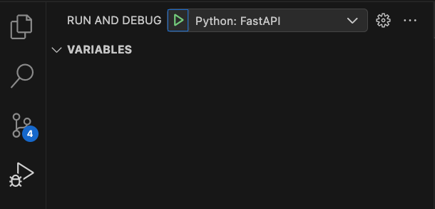

# PID Digitization Web API

This project includes the endpoints to digitize a PID diagram.

## Sections <!-- omit in toc -->

- [PID Digitization Web API](#pid-digitization-web-api)
  - [Endpoints](#endpoints)
    - [Detect Symbols \[POST /api/pid-digitization/symbol-detection/{pid\_id}\]](#detect-symbols-post-apipid-digitizationsymbol-detectionpid_id)
      - [Input](#input)
      - [Output](#output)
    - [Detect Text \[POST /api/pid-digitization/text-detection/{pid\_id}\]](#detect-text-post-apipid-digitizationtext-detectionpid_id)
      - [Input](#input-1)
      - [Output](#output-1)
  - [Configure](#configure)
  - [Permissions](#permissions)
  - [Source Code Directory Structure](#source-code-directory-structure)
  - [Running Locally](#running-locally)
    - [Prerequisites](#prerequisites)
    - [Dev container](#dev-container)
    - [Steps to run the project](#steps-to-run-the-project)
  - [Test](#test)

## Endpoints

### Detect Symbols [POST /api/pid-digitization/symbol-detection/{pid_id}]

This endpoint takes in a PID (in jpeg or png format) and detects the symbols of the image.

#### Input

- The PID Id
- The PID Image

#### Output

This endpoint stores some of the intermediate results in blob storage.
These results include:

- The input PID image
- The symbol detection inference results
- [If debug] the input image with the boxes drawn on the image

The response from the endpoint is a `JSON` object that has the following format.

```json
{
    "image_url": "pid2.png",
    "image_details": {
      "format": "png",
      "width": 1388,
      "height": 781
    },
    "label": [
      {
        "topX": 0.5067512555,
        "topY": 0.72654658,
        "bottomX": 0.5136717032,
        "bottomY": 0.7377242533,
        "id": 0,
        "label": "24",
        "score": 0.9782005548
      },
      ...
  ]
}
```

The values of `topX`, `topY`, `bottomX`, and `bottomY` are denormalized to the image dimensions, so `x in [0, 1]` and `y in [0, 1]`.

### Detect Text [POST /api/pid-digitization/text-detection/{pid_id}]

The endpoint stores the corrected symbol detected inference results and detects the text of the image (provided in symbol detection)

#### Input

- The PID Id
- The [symbol detected inference results](#output-1)

#### Output

This endpoint stores some of the intermediate results in blob storage.
These results include:

- All text detected on the PID image
- Only text associated with each symbol on the PID image
- [If debug] the input image with the text boxes drawn on the image
- [If debug] the input image with the symbol boxes with text associated drawn on the image

The response from the endpoint is a `JSON` object that has the following format.

```json
{
    "image_url": "pid2.png",
    "image_details": {
      "format": "png",
      "width": 1388,
      "height": 781
    },
    "all_text_list": [
        {
            "text": "GLR",
            "topX": 0.5067512555,
            "topY": 0.72654658,
            "bottomX": 0.5136717032,
            "bottomY": 0.7377242533,
        },
        ...
    ],
    "symbol_and_text_associated_list": [
        {
            "id": "<symbol_id>",
            "label": "<symbol_label>" ,
            "topX": 0.4067512554,
            "topY": 0.42654657,
            "bottomX": 0.4136717031,
            "bottomY": 0.6377242532,
            "text_associated": "ZLC"
        },
        ...
    ]
}
```

The values of `topX`, `topY`, `bottomX`, and `bottomY` are denormalized to the image dimensions, so `x in [0, 1]` and `y in [0, 1]`.

## Configure

The following configuration parameters may be defined...

- **ARROW_SYMBOL_LABEL** [DEFAULT=24]: The label of the arrow symbol

- **AZURE_CLIENT_ID** [OPTIONAL]: The client id of the service principal

- **AZURE_CLIENT_SECRET** [OPTIONAL]: The client secret of the service principal

- **AZURE_TENANT_ID** [OPTIONAL]: The tenant id of the Azure Directory

- **BLOB_STORAGE_ACCOUNT_URL** [REQUIRED]: The storage account url

- **BLOB_STORAGE_CONTAINER_NAME** [REQUIRED]: The name of the blob container where the PID, inference results, and intermediate steps are stored

- **DEBUG** [DEFAULT=False]: Denotes if the app is running in debug mode

- **DETECT_DOTTED_LINES** [DEFAULT=False]: This value is a configuration to determine if the Hough transform in the line detection step should detect dotted lines in a P&ID image. If false, it sets `LINE_DETECTION_HOUGH_MAX_LINE_GAP` to None (gaps aren't allowed) and `LINE_DETECTION_HOUGH_MIN_LINE_LENGTH` to 10 by default; if true, it sets `LINE_DETECTION_HOUGH_MAX_LINE_GAP` to 10 and `LINE_DETECTION_HOUGH_MIN_LINE_LENGTH` to None by default. Note that those config values can be tuned per request as well, based on the length of the segments and gaps of the dotted lines in the specific image to get the desired results.

- **ENABLE_PREPROCESSING_TEXT_DETECTION** [DEFAULT=True]: Denotes if image preprocessing is enabled for the text detection service

- **FLOW_DIRECTION_ASSET_PREFIXES** [DEFAULT=Equipment/,Piping/Endpoint/Pagination]: The prefixes of the assets should always connect to the process flow line to assign flow direction.

- **FORM_RECOGNIZER_API_KEY** [REQUIRED]: The form recognizer API key.

- **FORM_RECOGNIZER_ENDPOINT** [REQUIRED]: The form recognizer endpoint.

- **GRAPH_DB_AUTHENTICATE_WITH_AZURE_AD** [DEFAULT=False]: This parameter specifies whether Azure Active Directory authentication has to be used when connecting to the Graph SQL database.

- **GRAPH_DB_CONNECTION_STRING** [REQUIRED]: This parameter specifies the Graph SQL database connection string.

- **GRAPH_DISTANCE_THRESHOLD_FOR_SYMBOLS_PIXELS** [DEFAULT=5]: The distance threshold, in pixels, for line-to-symbol connections during the graph construction candidate matching step. This is a default provided from initial tests, and could be fine-tuned based on the characteristics of typical images being processed in the future. In general, setting this to a higher value may increase the chances of false positives; a lower value may miss out on some connections.

- **GRAPH_DISTANCE_THRESHOLD_FOR_TEXT_PIXELS** [DEFAULT=5]: The distance threshold, in pixels, for line-to-text connections during the graph construction candidate matching step. This is a default provided from initial tests, and could be fine-tuned based on the characteristics of typical images being processed in the future. In general, setting this to a higher value may increase the chances of false positives; a lower value may miss out on some connections.

- **GRAPH_DISTANCE_THRESHOLD_FOR_LINES_PIXELS** [DEFAULT=50]: The distance threshold, in pixels, for line-to-lines connections during the graph construction candidate matching step. This is a default provided from initial tests, and could be fine-tuned based on the characteristics of typical images being processed in the future. In general, setting this to a higher value may increase the chances of false positives; a lower value may miss out on some connections.

- **GRAPH_LINE_BUFFER_PIXELS** [DEFAULT=5]: The value, in pixels, of the buffer size used to generate the buffered line segment polygon during the graph construction candidate matching step - see [the `shapely` docs](https://shapely.readthedocs.io/en/stable/reference/shapely.buffer.html) for more configuration details. This is a default provided from initial tests, and could be fine-tuned based on the characteristics of typical images being processed in the future. In general, setting this to a higher value may increase the chances of false positives; a lower value may miss out on some connections.

- **GRAPH_SYMBOL_TO_SYMBOL_DISTANCE_THRESHOLD_PIXELS** [DEFAULT=10]: The distance threshold, in pixels, for symbol-to-symbol connections during the graph construction step to connect symbols in close proximity to one another, and is intended to capture nearby symbols that don't have any lines connecting them, but where the connection is implied by proximity. This is a default provided from initial tests, and could be fine-tuned based on the characteristics of typical images being processed in the future. In general, setting this to a higher value may increase the chances of false positives; a lower value may miss out on some connections.

- **GRAPH_SYMBOL_TO_SYMBOL_OVERLAP_REGION_THRESHOLD** [DEFAULT=0.7]: The overlap threshold to invoke a symbol to symbol connection to connect symbols that might not have an explicit line between them or to cover for process flow line breaks.

- **INFERENCE_SCORE_THRESHOLD** [DEFAULT=0.5]: A threshold where results lower than this value will not be returned

- **INFERENCE_SERVICE_RETRY_COUNT** [DEFAULT=3]: Number of times the Symbol Detection AML endpoint will be called before failing

- **INFERENCE_SERVICE_RETRY_BACKOFF_FACTOR** [DEFAULT=0.3]: The backoff factor that is used in the default requests backoff algorithm `{backoff_factor} * (2 ** ({number_retries} - 1))`

- **LINE_DETECTION_HOUGH_THRESHOLD** [DEFAULT=5]: This parameter defines the threshold value utilized in the Hough transform algorithm to detect pixels in the image. It acts as an initial value and can be fine-tuned during the graph construction phase of the API request, taking into account the unique characteristics of the image, if needed.

- **LINE_DETECTION_HOUGH_MIN_LINE_LENGTH** [DEFAULT=10 if `DETECT_DOTTED_LINES` is `False`, DEFAULT=None if `DETECT_DOTTED_LINES` is `True`]: This parameter sets the minimum length of a line utilized in the Hough transform algorithm, in terms of pixels, to be considered as a valid line in the image. It is recommended to start with a default value and fine-tune it based on the image properties during the graph construction phase of the API request, if required.

- **LINE_DETECTION_HOUGH_MAX_LINE_GAP** [DEFAULT=None if `DETECT_DOTTED_LINES` is `False`, DEFAULT=10 if `DETECT_DOTTED_LINES` is `True`]: This parameter defines the maximum permissible gap utilized in the Hough transform algorithm, in terms of pixel distance, between line segments to treat them as a single continuous line in the image. It helps in combining smaller dashed line segments into solid lines whenever dashed lines are detected using the Hough algorithm. Although the default value is a good starting point, it may need adjustment based on the presence of dashed lines in the image during the graph construction phase of the API request.

- **LINE_DETECTION_HOUGH_RHO** [DEFAULT=0.1]: This parameter determines the distance resolution utilized in the Hough transform algorithm, in pixels, of the accumulator used for line detection in the image. Starting with the default value is recommended, and it can be fine-tuned during the graph construction phase of the API request based on the image characteristics, if necessary.

- **LINE_DETECTION_HOUGH_THETA** [DEFAULT=1080]: This parameter represents the angular resolution utilized in the Hough transform algorithm, in radians, of the accumulator considered for line detection in the image. It is advisable to begin with the default value and adjust it if required during the graph construction phase of the API request if diagonal lines aren't being detected as needed, based on the specific image properties.

- **LINE_DETECTION_JOB_TIMEOUT_SECONDS** [DEFAULT=300]: This parameter specifies the timeout duration, in seconds, for the line detection step.

- **LINE_SEGMENT_PADDING_DEFAULT** [DEFAULT=0.2]: Default value (normalized) of the padding used to extend lines as a preprocessing step in the graph construction algorithm ([docs](../docs/graph-construction-design.md#line-segment-preprocessing)). This is used to connect lines whose start/end points are in close proximity - setting this to a higher value may increase the chances of false positives; a lower value may miss out on some connections.

- **PORT** [DEFAULT=8000]: Only used when running as a module; this value is used to control the port the app runs on

- **SYMBOL_DETECTION_API** [REQUIRED]: The base url of the symbol detection api

- **SYMBOL_DETECTION_API_BEARER_TOKEN** [REQUIRED]: The bearer token for the symbol detection api

- **SYMBOL_LABEL_FOR_CONNECTORS** [DEFAULT='Piping/Endpoint/Pagination']: This is a parameter to specify what labels are considered connectors. This is used to determine if a symbol is a connector or not.

- **SYMBOL_LABEL_PREFIXES_WITH_TEXT** [DEFAULT='Equipment/,Instrument/,Piping/Endpoint/Pagination']: A comma separated list of prefixes of symbols that should have text (for text detection).

- **SYMBOL_LABEL_PREFIXES_TO_CONNECT_IF_CLOSE** [DEFAULT='Equipment', 'Instrument/Valve/', 'Piping/Fittings/Mid arrow flow direction', 'Piping/Fittings/Flanged connection']: A comma separated list of prefixes of symbols that will be connected together if they meet the graph_symbol_to_symbol_overlap_region_threshold.

- **SYMBOL_LABEL_PREFIXES_TO_INCLUDE_IN_GRAPH_IMAGE_OUTPUT** [DEFAULT='Equipment/,Instrument/Valve/,Piping/Endpoint/Pagination']: A comma separated list of prefixes of symbol labels that should be included in the graph construction `networkx` output image. Note that only the default categories and sensors have hard-coded colors currently for the output graph.

- **SYMBOL_OVERLAP_THRESHOLD** [DEFAULT=0.6]: The overlap threshold to invoke a score comparison to prune out symbols in symbol detection.

- **TEXT_DETECTION_AREA_INTERSECTION_RATIO_THRESHOLD** [DEFAULT=0.8]: This value is used to determine if text is considered inside or outside the symbol.
  The intersection ratio is calculated using the intersection of the text bounding box and the symbol bounding box and divides by the text bounding box area.
  Values can range from 0 to 1.

- **TEXT_DETECTION_DISTANCE_THRESHOLD** [DEFAULT=0.01]: This value is used to prune out text that is too far to be considered valid text for a symbol. The value is normalized, so values can range from 0 to 1.

- **VALVE_SYMBOL_PREFIX** [DEFAULT=Instrument/Valve]: This value is used to define the prefix of the valve symbols.

- **WORKERS_COUNT_FOR_DATA_BATCH** [DEFAULT=3]: This parameter specifies the maximum number of workers that will be used by candidate matching, which should be determined based on the available CPU cores. It is recommended to use a lower number of workers compared to the available CPU cores. This approach ensures that the current process does not experience a shortage of CPU resources, enabling it to perform its task efficiently. Depending on the number of computations to be performed, each process can utilize a CPU core. It is important to note that each process has its own dedicated memory space and does not share memory with other processes.

## Permissions

- **Storage account**: Storage Blob Data Owner

## Source Code Directory Structure

It will follow the below directory structure:

- `src`
  - `graph-db-model`: Contains the definition of the graph database model.
  - `app`
    - `models`: Contains model classes such as bounding boxes, as well as the contracts for inference results
    - `routes`
      - `controllers`: Contains the controllers that define exposed API routes for the inferencing service
    - `services`
      - `symbol_detection`: Contains the definition of the symbol detection inference service, and related code for
      image inferencing client
      - `text_detection`: Contains the definition of the text detection inference service, and related code for performing OCR on input images
      - `line_detection`: Contains the definition of the line detection inference service
      - `graph_construction`: Contains the definition of the graph construction inference service
        - `tools`: The [tools](./app/services/graph_construction/tools/README.md) used to help debug graph construction.
      - `graph_persistence`: Contains the definition of the graph persistence inference service, and related code for
      storing the graph in the database
  - `__tests__`
    - `unit`: Contains unit tests (directory structure will mimic that of `src/app` to ensure all appropriate files are unit-tested)

## Running Locally

### Prerequisites

- Python 3.9
- [Docker (Optional)](https://www.docker.com/)

**NOTE:** If the storage account does not support full public internet access, ensure your IP is added to the firewall rule of the storage account.

### Dev container

See [this document on local development setup](../docs/local_development_setup.md) for instructions on setting up the VSCode dev container included in the repo.

### Steps to run the project

If running outside of the `dev-container` create your virtual environment.

```bash
python -m venv venv
source ./venv/Scripts/activate # or ./venv/bin/activate
```

To copy .env.sample to .env:

```bash
cp .env.sample .env
```

Install the dependencies:

```bash
pip install -r requirements.txt
```

Run the API.
This can be done via command line:

```bash
python -m init_app
# or
gunicorn init_app:app -k uvicorn.workers.UvicornWorker -b 0.0.0.0
```

or via the VSCode debugger using the provided launch task "Python: FastAPI".



Once the app starts, visit `localhost:{PORT}/docs` to view the autogenerated Swagger definition for the API.
You can make requests using the Swagger UI, or via the Postman collection [provided in this repo](../docs/postman/PID_Digitization.postman_collection.json).

## Test

To run unit tests, run the command:

```bash
pytest # or python -m pytest
```

For more information on the unit test setup in the project, see [the relevant section](../docs/local_development_setup.md#running-unit-tests) in the local development setup documentation.
